# 大模型技术知识库

## 目录

- [大模型技术知识库](#大模型技术知识库)
	- [目录](#目录)
	- [一、Transformer架构](#一transformer架构)
		- [1.1 核心结构](#11-核心结构)
		- [1.2 归一化（Normalization）](#12-归一化normalization)
		- [1.3 Pre-Norm vs Post-Norm](#13-pre-norm-vs-post-norm)
		- [1.4 Multi-Head Self-Attention](#14-multi-head-self-attention)
		- [1.5 位置编码（Positional Encoding）](#15-位置编码positional-encoding)
	- [二、数据处理](#二数据处理)
		- [2.1 分词（Tokenization）](#21-分词tokenization)
		- [2.2 BPE（Byte Pair Encoding）](#22-bpebyte-pair-encoding)
		- [2.3 WordPiece](#23-wordpiece)
		- [2.4 Unigram](#24-unigram)
		- [2.5 词表设计考量](#25-词表设计考量)
	- [三、模型训练](#三模型训练)
		- [3.1 显存分析](#31-显存分析)
		- [3.2 数值精度](#32-数值精度)
		- [3.3 训练流程](#33-训练流程)
		- [3.4 学习率调度](#34-学习率调度)
		- [3.5 Batch Size选择](#35-batch-size选择)
	- [四、参数高效微调（PEFT）](#四参数高效微调peft)
		- [4.1 全量微调的挑战](#41-全量微调的挑战)
		- [4.2 Prompt Tuning](#42-prompt-tuning)
		- [4.3 Prefix Tuning](#43-prefix-tuning)
		- [4.4 Adapter Tuning](#44-adapter-tuning)
		- [4.5 LoRA（Low-Rank Adaptation）](#45-loralow-rank-adaptation)
		- [4.6 参数类型注意事项](#46-参数类型注意事项)
	- [五、推理优化](#五推理优化)
		- [5.1 推理两阶段](#51-推理两阶段)
		- [5.2 KV Cache](#52-kv-cache)
		- [5.3 Flash Attention](#53-flash-attention)
		- [5.4 PagedAttention（vLLM）](#54-pagedattentionvllm)
		- [5.5 Continuous Batching](#55-continuous-batching)
		- [5.6 解码策略](#56-解码策略)
		- [5.7 投机解码（Speculative Decoding）](#57-投机解码speculative-decoding)
	- [六、vLLM推理引擎](#六vllm推理引擎)
		- [6.1 编译安装](#61-编译安装)
		- [6.2 目录结构](#62-目录结构)
		- [6.3 LLM初始化](#63-llm初始化)
		- [6.4 generate接口](#64-generate接口)
	- [七、RAG（检索增强生成）](#七rag检索增强生成)
		- [7.1 解决的问题](#71-解决的问题)
		- [7.2 系统架构](#72-系统架构)
		- [7.3 文档处理](#73-文档处理)
		- [7.4 向量检索](#74-向量检索)
		- [7.5 重排序（Rerank）](#75-重排序rerank)
		- [7.6 高级检索技术](#76-高级检索技术)
		- [7.7 HyDE（Hypothetical Document Embeddings）](#77-hydehypothetical-document-embeddings)
		- [7.8 多轮对话](#78-多轮对话)
	- [八、多模态](#八多模态)
		- [8.1 Vision Transformer（ViT）](#81-vision-transformervit)
		- [8.2 CNN vs Transformer](#82-cnn-vs-transformer)
		- [8.3 CLIP](#83-clip)
		- [8.4 CLIP负样本构建](#84-clip负样本构建)
		- [8.5 CLIP Zero-Shot分类](#85-clip-zero-shot分类)
		- [8.6 SAM（Segment Anything Model）](#86-samsegment-anything-model)
		- [8.7 多模态大模型](#87-多模态大模型)
		- [8.8 目标检测应用](#88-目标检测应用)
	- [九、模型量化](#九模型量化)
		- [9.1 量化基础](#91-量化基础)
		- [9.2 量化方法](#92-量化方法)
		- [9.3 TPU-MLIR](#93-tpu-mlir)
	- [十、Agent与工具调用](#十agent与工具调用)
		- [10.1 角色智能体构建](#101-角色智能体构建)
		- [10.2 MCP（Model Context Protocol）](#102-mcpmodel-context-protocol)
	- [十一、Scaling Law](#十一scaling-law)
		- [11.1 核心发现](#111-核心发现)
		- [11.2 Chinchilla Law](#112-chinchilla-law)
		- [11.3 涌现能力（Emergent Abilities）](#113-涌现能力emergent-abilities)
	- [十二、大模型发展脉络](#十二大模型发展脉络)
		- [12.1 大模型内核](#121-大模型内核)
		- [12.2 机器学习四个范式](#122-机器学习四个范式)
		- [12.3 基于大模型的对话系统架构](#123-基于大模型的对话系统架构)
		- [12.4 里程碑模型](#124-里程碑模型)
		- [12.5 技术演进](#125-技术演进)

---

## 一、Transformer架构

### 1.1 核心结构

- 由Multi-Head Self-Attention和FFN（Feed-Forward Network）前馈网络组成

- 采用残差连接（Residual Connection），借鉴ResNet解决梯度消失和加速收敛问题

- 两种模式
	- Encoder：双向注意力，可看到完整上下文
	- Decoder：单向注意力（Causal Mask），只能看到历史信息

- 核心组件功能
	- Attention：捕获上下文依赖关系
	- FFN：存储参数化知识

- 架构示意图
	-  
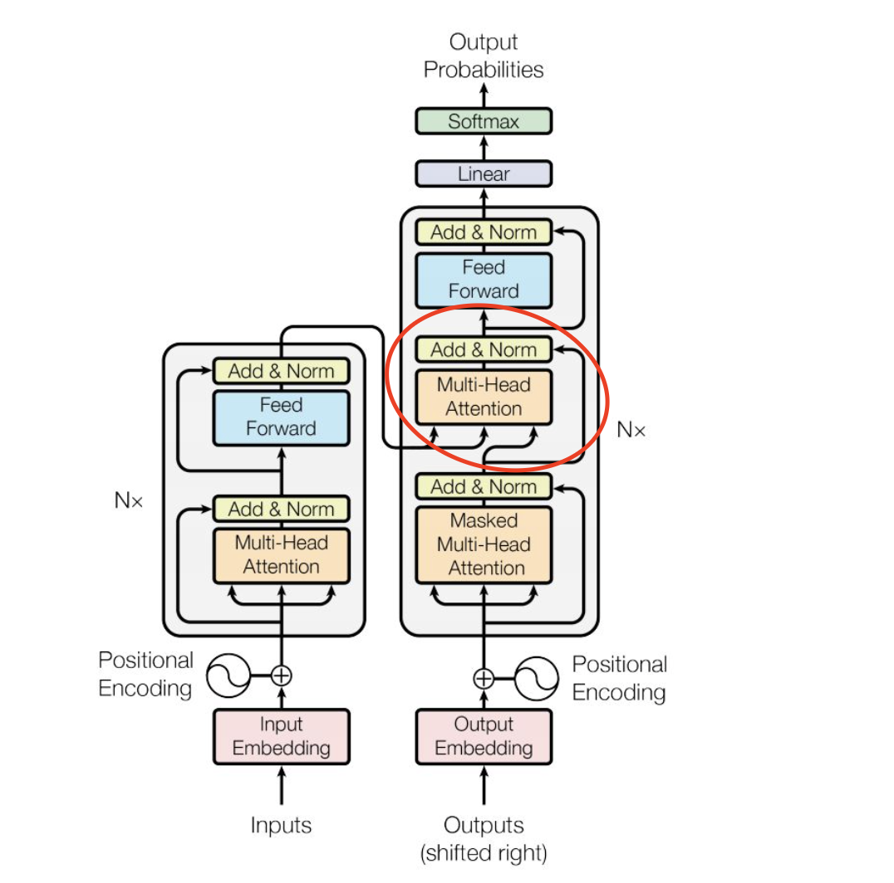

### 1.2 归一化（Normalization）

- Layer Normalization（LN）vs Batch Normalization（BN）

	- 共同目标：将数据归一化至标准正态分布，加速收敛，提高训练稳定性

	- BN（Batch Normalization）
		- 对同一batch内、同一特征维度的数据做归一化
		- 训练时使用batch统计量，推理时使用全局移动平均
		- 具有正则化效果：样本输出依赖batch内其他样本
		- 缺点：无法处理变长序列，依赖batch统计量

	- LN（Layer Normalization）
		- 对单个样本的所有特征维度做归一化
		- 优点：不依赖batch size和序列长度
		- 适用于RNN、Transformer等序列模型

### 1.3 Pre-Norm vs Post-Norm

- 结构对比图
	-  
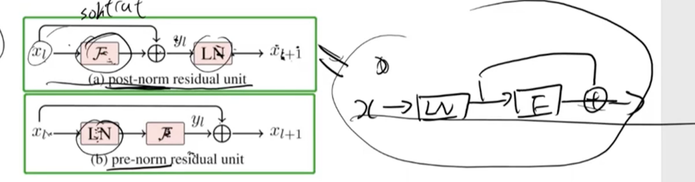

- Post-Norm：残差连接后做归一化
	- 正则化效果更强，模型鲁棒性更好
	- 适合浅层网络

- Pre-Norm：残差连接前做归一化
	- 梯度流更稳定，防止梯度爆炸/消失
	- 适合深层网络（如GPT-3、LLaMA）
	- 说明：下图中LN和F不能互换位置，因为LN是正态分布，数值范围较小

### 1.4 Multi-Head Self-Attention

- 为什么Q、K、V使用不同的投影矩阵

	- 将同一向量映射到不同语义子空间，增强表达能力

	- 若使用相同矩阵，自身点积最大，softmax后自身权重过高，无法有效利用上下文

- 计算复杂度：O(n²·d)，其中n为序列长度，d为隐藏维度

- 加速技术：KV-Cache、Flash Attention、PagedAttention

### 1.5 位置编码（Positional Encoding）

- 绝对位置编码：正弦/余弦函数，可学习位置嵌入

- 相对位置编码：ALiBi、RoPE

- 旋转位置编码（RoPE）
	- 通过旋转矩阵编码相对位置
	- 支持长度外推
	- 被LLaMA、Qwen等主流模型采用
	- 原理示意图
		-  
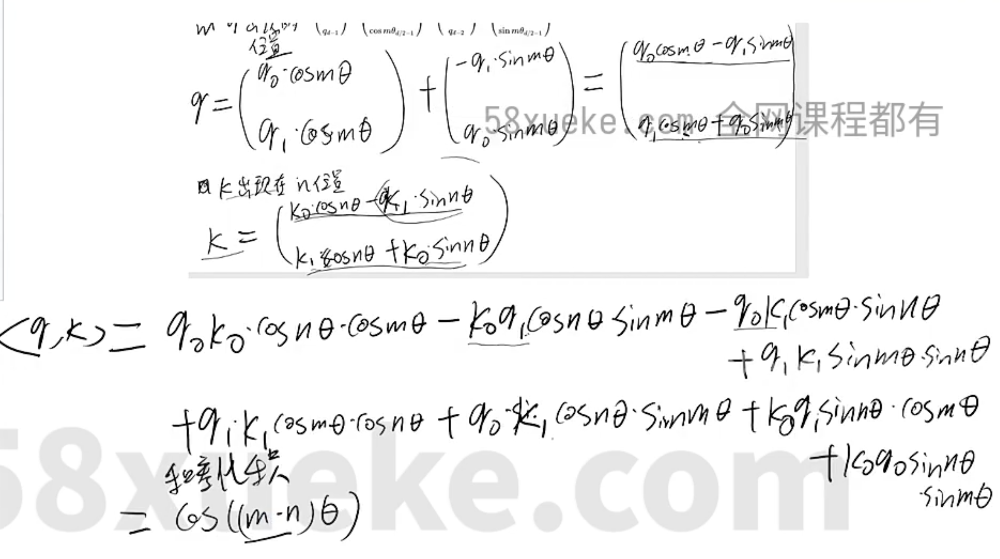

## 二、数据处理

### 2.1 分词（Tokenization）

- 分词粒度

	- 单词级（Word-level）
		- 英文：空格分词
		- 中文：jieba分词或按字切分

	- 字符级（Character-level）
		- 英文：按字母
		- 中文：按字

	- 子词级（Subword-level）
		- 核心思想：高频词保留，低频词拆分为子词
		- 主流方法：BPE、WordPiece、Unigram
		- 词表生成：根据训练数据生成
			- 英文词表：est, er, ing（均为常见英文词缀）
			- 中文词表：中国，人民币（均为中文完整词语）

### 2.2 BPE（Byte Pair Encoding）

- 应用：GPT系列、LLaMA等

- 词表构建流程

	- Step 1：初始化词表为所有字符 + 特殊标记（如</w>）

	- Step 2：统计相邻字符对频率

	- Step 3：合并最高频字符对，更新词表

	- Step 4：重复Step 2-3直到达到目标词表大小

- 构建示例
	- 语料库单词频率：old(7), older(3), highest(9), lowest(4)
	- 添加结束标记：old</w>(7), older</w>(3), highest</w>(9), lowest</w>(4)
	- Token频率统计
		-  
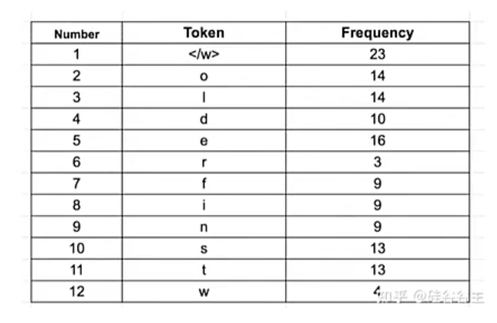

	- 迭代1：合并"e"+"s"→"es"（出现13次）
		-  
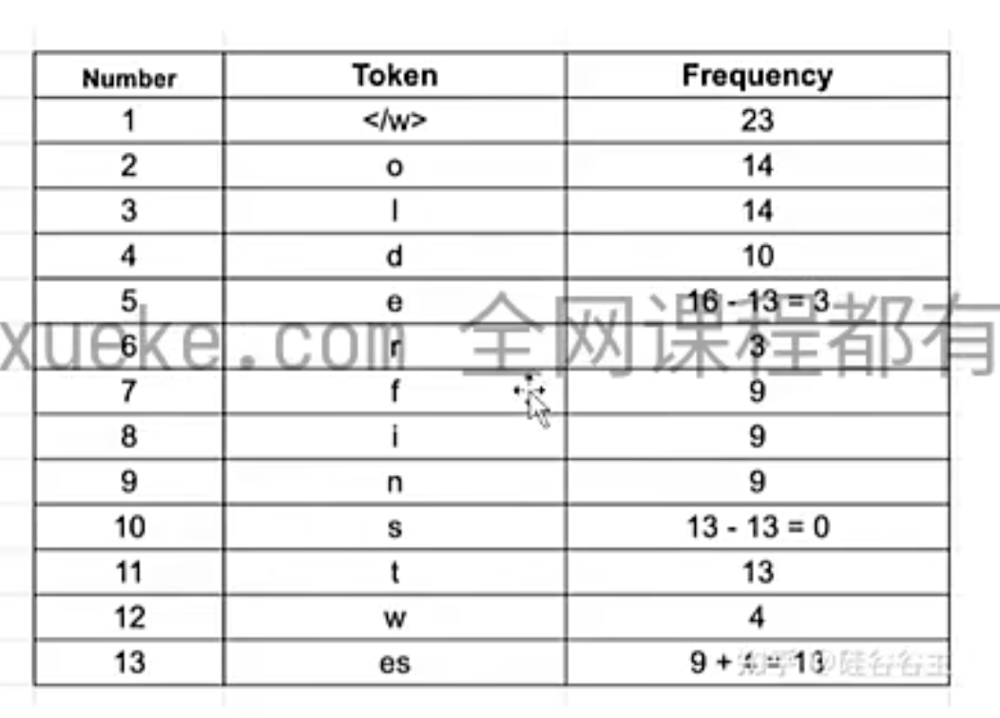

	- 迭代2：合并"es"+"t"→"est"（出现13次）
		-  
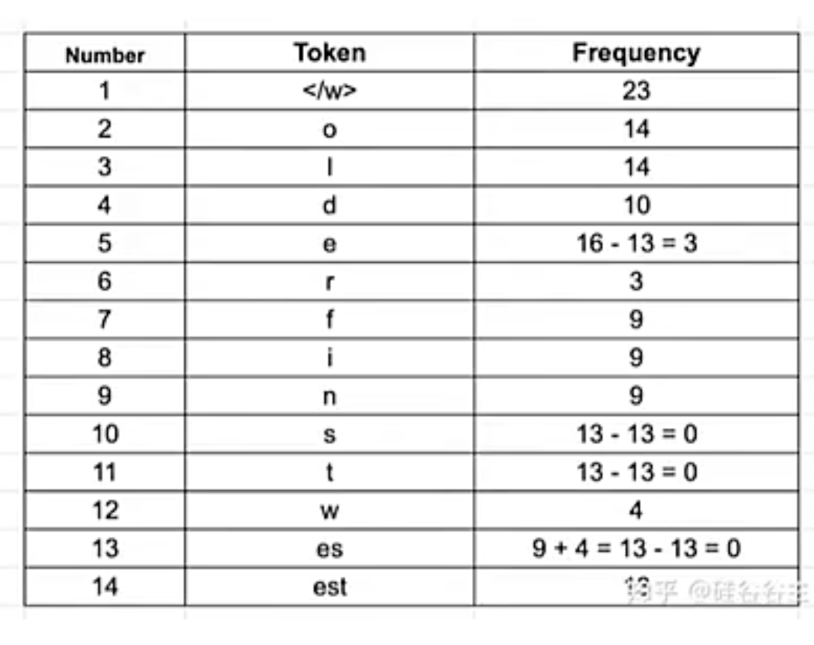

	- 迭代3：合并"est"+"</w>"→"est</w>"（出现13次）
		-  
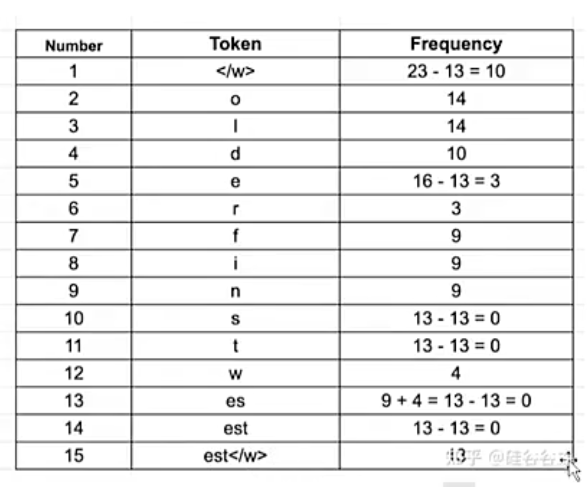

	- 迭代4：合并"o"+"l"→"ol"（出现10次）
		-  
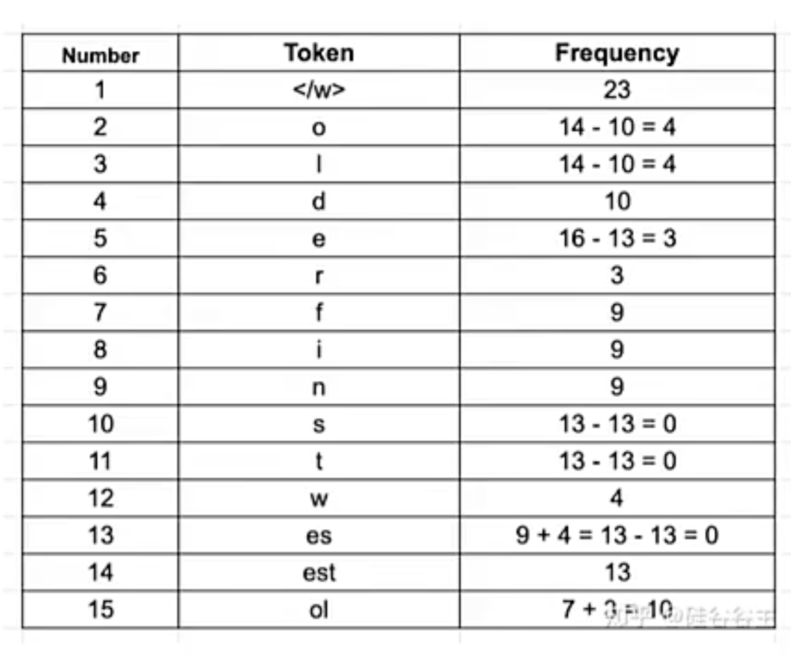

	- 最终结果（通过训练数据得到子词）
		-  
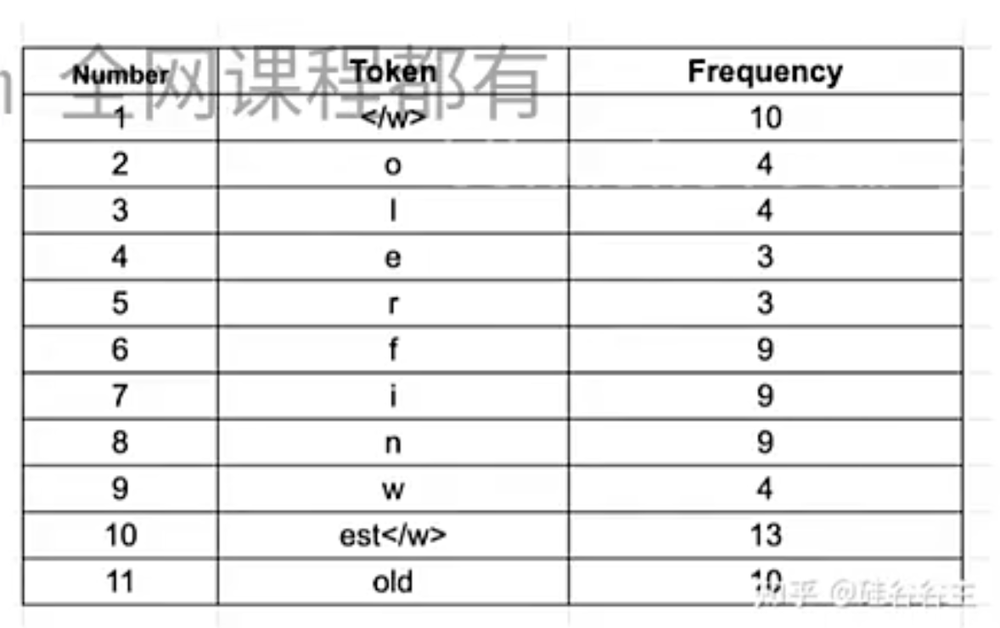

- 编码流程
	- 将词表按长度降序排列
	- 贪心匹配：优先匹配最长子词
	- 未匹配部分使用<UNK>标记

- 多语言处理
	- 基于UTF-8字节编码，语言无关
	- 一个汉字可能对应1-3个token

### 2.3 WordPiece

- 应用：BERT、DistilBERT

- 与BPE区别：使用似然增益而非频率选择合并对
	-  
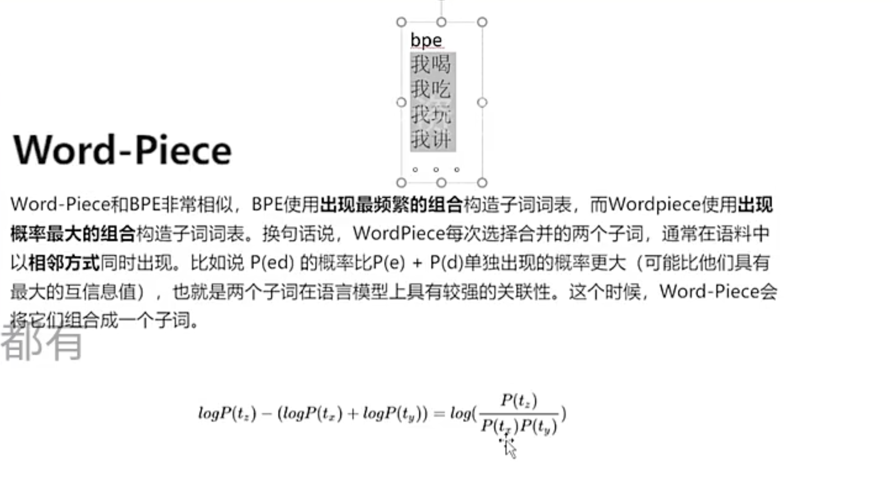

### 2.4 Unigram

- 应用：T5、mBART

- 原理
	- 从大词表开始，逐步删除子词
	- 删除标准：移除后语言模型损失增加最小的子词
	- 去除子词会增加Loss（信息熵），表示信息混乱程度增加
	-  
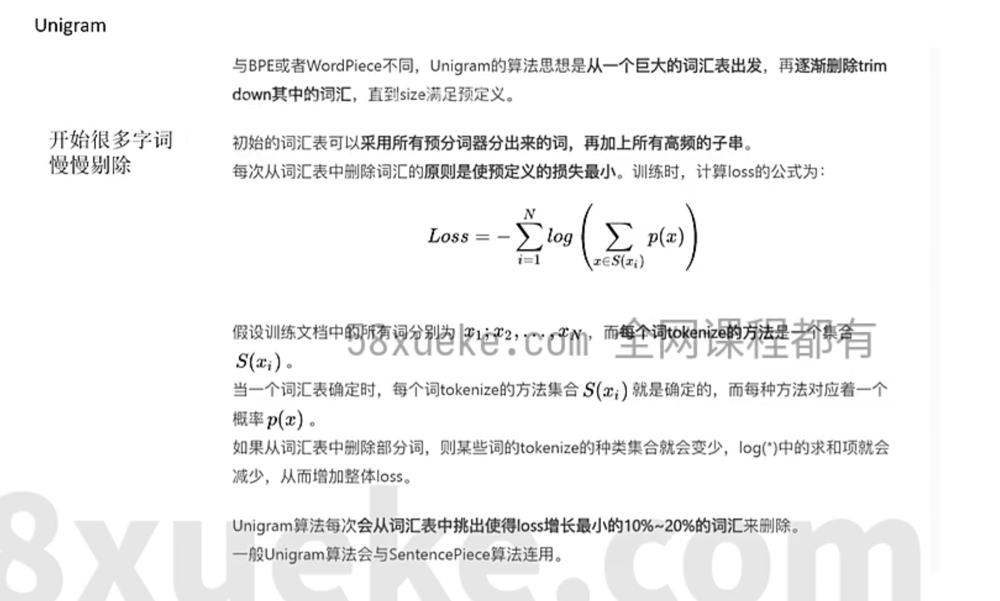

### 2.5 词表设计考量

- 词表过小
	- 语义表征能力不足
	- 序列过长，计算开销大

- 词表过大
	- 输出层softmax计算慢
	- 低频token训练不充分
	- 需要更大的Embedding层

- 各大LLM的词汇表大小和性能对比
	-  
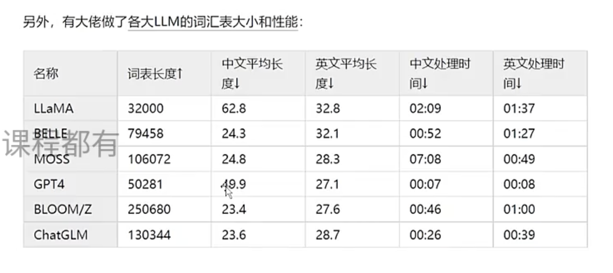

- 垂直场景是否需要自训练分词器
	-  
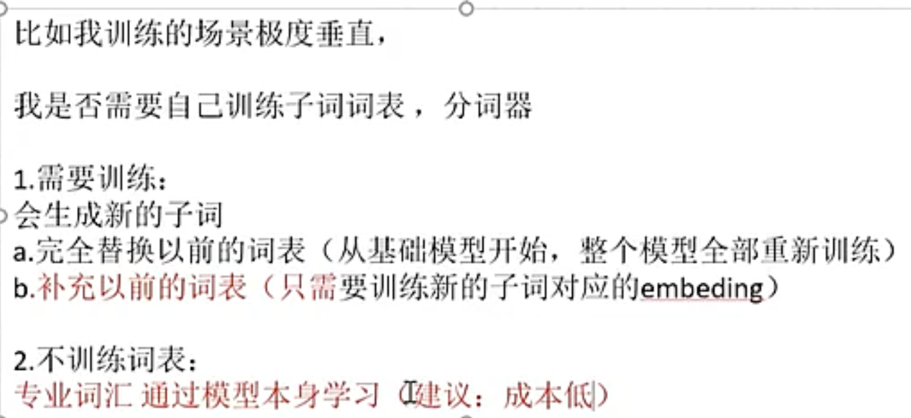

## 三、模型训练

### 3.1 显存分析

- 符号定义
	- b：batch size
	- s：sequence length
	- h：hidden size
	- L：层数
	- a：attention头数
	- Φ：模型参数量

- 显存里存储的数据
	- 模型参数：Φ个浮点数
	- Adam优化器状态：前向结果 + 历史梯度
	- 总体估算：约 n × 6 × Φ（n为batch相关系数）

- 前向传播激活值显存

	- Attention块：11sbh + 5as²b bytes
		-  
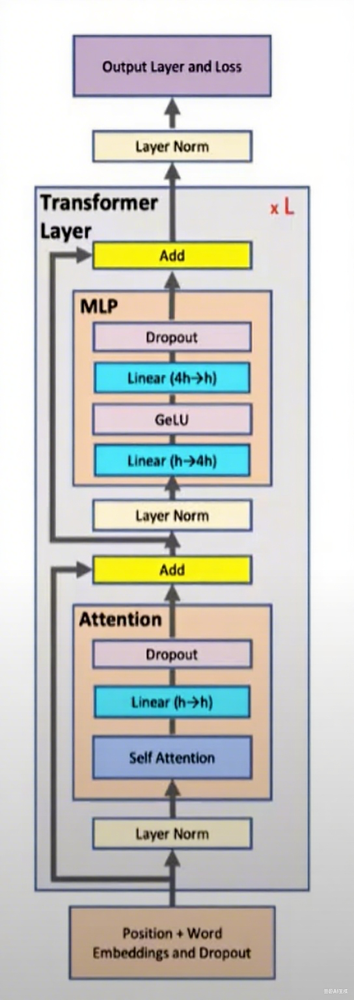

		- QKV矩阵相乘：只需存储共享的输入，大小为2sbh
		- QK^T：需要同时存储Q和K，总共4sbh
		- softmax：反向传播需要2as²b的softmax输出
		- softmax dropout：只需as²b的mask大小
		- attention×V：需要存储dropout输出（2as²b）和Values（2sbh），共2as²b+2sbh
		- linear projection：存储输入激活2sbh，attention dropout需要sbh的掩码
		- 总计：11sbh+5as²b bytes

	- FFN块：19sbh bytes
		- 两个线性层分别使用2sbh和8sbh的输入存储
		- GeLU非线性：反向传播需要8sbh的输入
		- dropout：使用sbh的掩码存储
		- 总计：19sbh bytes

	- LayerNorm：4sbh bytes
		- 每个LayerNorm使用2sbh的输入存储，两个共4sbh

	- 单层总计：34sbh + 5as²b bytes

	- 全模型激活值：sbhL(34 + 5as/h) bytes

- 反向传播显存（混合精度训练）

	-  
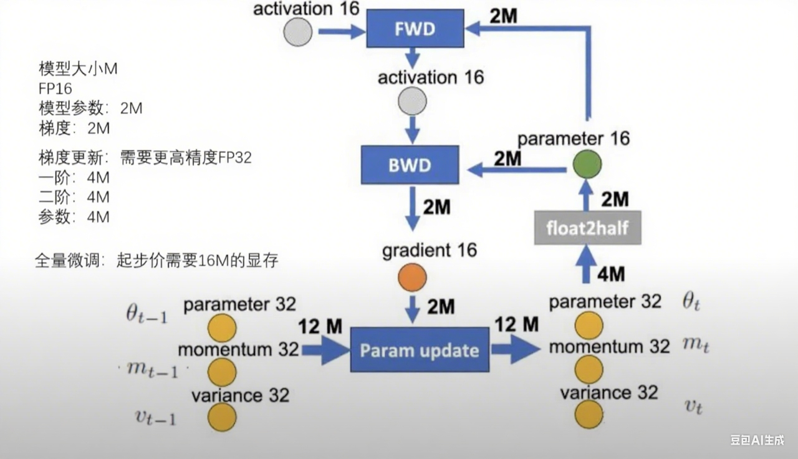

	- 前向传播用FP16，更新参数用FP32

	- 模型参数（FP16）：2Φ bytes
	- 梯度（FP16）：2Φ bytes
	- 优化器状态（Adam，FP32）：
		- 主参数副本：4Φ bytes
		- 一阶动量：4Φ bytes
		- 二阶动量：4Φ bytes
	- 总计：16Φ bytes
	- 示例：1B模型全量微调至少需要16GB显存

- 训练总显存：16Φ + sbhL(34 + 5as/h) bytes

- 推理显存

	- 模型参数（FP16）：2Φ bytes
	- KV Cache：4bLh(s + n) bytes，其中n为生成长度
	- 经验估算：约2.4Φ bytes
	- 示例：7B模型推理约需 2.4 × 7 ≈ 16.8GB显存

### 3.2 数值精度

- FP32（单精度）：4 bytes，训练默认精度

- FP16（半精度）：2 bytes，推理常用

- BF16（Brain Float 16）：2 bytes
	- 与FP32相同的指数位，数值范围更大
	- 精度略低于FP16
	- 训练更稳定，被主流大模型采用

- 混合精度训练
	- 前向/反向传播：FP16/BF16
	- 参数更新：FP32（避免精度损失）

### 3.3 训练流程

- 预训练（Pre-training）
	- 数据：大规模无监督文本
	- 目标：Next Token Prediction

- 监督微调（SFT）
	- 数据：高质量问答对
	- 目标：指令遵循能力

### 3.4 学习率调度

- Warmup阶段：1e-7 → 1e-4（学习慢时调高）

- 衰减阶段：1e-4 → 1e-6（震荡厉害时调低）

- 策略：Cosine Decay、Linear Decay

- 动态调整：代码中监控loss震荡，自动降低学习率

### 3.5 Batch Size选择

- 过小：梯度估计方差大，训练不稳定（学习抖动）

- 过大：显存占用高，易陷入局部最优，缺乏探索性

- 经验做法
	- 从大到小尝试，直到显存能跑
	- 尽量榨干GPU性能
	- 配合梯度累积模拟更大batch

## 四、参数高效微调（PEFT）

### 4.1 全量微调的挑战

- 参数量大，显存需求高（16倍参数量）
	- 示例：6B参数模型，batch_size=10
	- 显存需求：6 × 6B × 10 ≈ 360GB显存
	- 实际做法：只训练部分层（如倒数2层，约2000万参数）

- 显存限制导致的约束
	- 可训练参数不能太多
	- Batch size不能太大
	- Max length不能太大
	- 经验：统计平均长度（去除异常值）× 1.5作为max_length

- 需要大量标注数据
	- 经验法则：token数量 ≥ 可训练参数数量

- 训练时间长，不易收敛

- 灾难性遗忘风险

### 4.2 Prompt Tuning

- 在输入前添加可学习的软提示（Soft Prompt）

- 只训练提示向量，冻结模型参数

- 示例：问题"今天天晴，温度25度。今天能否打篮球"
	- 添加软提示后模型更好理解任务意图

- 适合：任务切换频繁的场景

### 4.3 Prefix Tuning

- 在每层Attention的K、V前添加可学习前缀

- 比Prompt Tuning表达能力更强

- 示例：[a b c d e] + "今天能否打篮球" → "今天可以打篮球"
	- Prompt加真实提示词，Prefix加虚拟token

- 参数量：前缀长度 × 层数 × 隐藏维度 × 2

### 4.4 Adapter Tuning

- 在Transformer层中插入小型适配器模块

- 结构：Down-projection → 非线性 → Up-projection

- 参数量：约原模型的1-5%

### 4.5 LoRA（Low-Rank Adaptation）

- 核心思想：用低秩矩阵近似权重更新 ΔW = BA

- 参数量：r × (d_in + d_out)，r为秩

- 优点
	- 无推理延迟（可合并到原权重）
	- 支持多任务切换
	- 显存友好

- 变体：QLoRA（量化+LoRA）、DoRA、LoRA+

### 4.6 参数类型注意事项

- 可训练参数建议使用FP32，避免NaN/Inf

- 冻结参数可使用FP16/BF16节省显存

## 五、推理优化

### 5.1 推理两阶段

- Prefill阶段
	- 处理输入prompt
	- 计算所有token的KV Cache
	- 可并行计算，计算密集型
	- 示意图
		-  
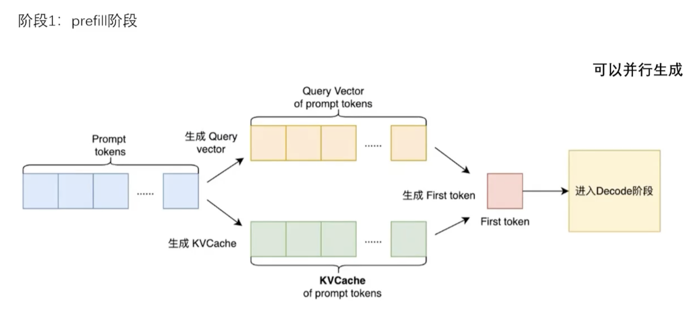

- Decode阶段
	- 自回归生成token
	- 每步只计算一个token
	- 串行执行，访存密集型
	- 示意图
		-  
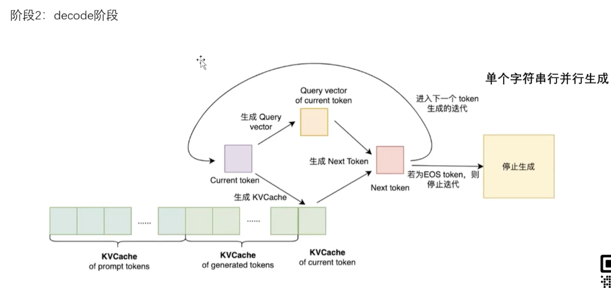

- 显存占用公式
	-  
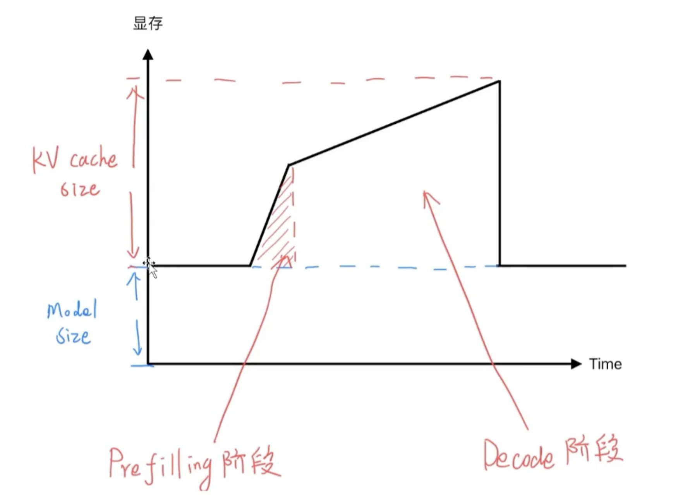
	- Memory = batch_size × seq_length × hidden_size × layers × 2 × 2
	- 说明：序列长度、隐藏维度、层数、KV两个、FP16占2字节

- Prefill vs Decode显存特点
	- Prefill：prompt长度已知，可精确预分配显存
	- Decode：生成长度未知，需动态管理KV Cache

### 5.2 KV Cache

- 作用：缓存历史token的K、V向量，避免重复计算

- 显存占用：2 × b × L × s × h × sizeof(dtype)

- KV Cache公式
	- 2 × batch_size × num_layers × max_seq_len × (hidden_size/num_heads) × num_heads × sizeof(dtype)

- 优化方向
	- 量化：KV Cache INT8/INT4
	- 稀疏：选择性保留重要token
	- 共享：GQA、MQA

### 5.3 Flash Attention

- 核心思想：通过重新设计注意力计算顺序，减少HBM（显存）访问，利用SRAM（片上缓存）加速

- 传统Attention的问题
	- 显存访问瓶颈
		- 计算流程：Q×K^T → Softmax → ×V
		- 中间结果（N×N的注意力矩阵）需要写回HBM
		- HBM带宽慢（约1.5TB/s），成为性能瓶颈
	- 示例：序列长度1024，中间矩阵1024×1024需要4MB显存
	- 访存密集型：大量时间花在数据搬运上，而非计算

- Flash Attention优化策略

	- Tiling（分块计算）
		- 将Q、K、V矩阵分块（如64×64的tile）
		- 每次只加载一小块到SRAM中计算
		- 逐块计算Attention，无需完整的N×N矩阵
		- 减少HBM访问次数：O(N²) → O(N²/M)，M为SRAM大小

	- Recomputation（重计算）
		- 前向传播：不保存完整的注意力矩阵
		- 反向传播：需要时重新计算注意力分数
		- 用计算换存储：反向时重算比保存中间结果更快

	- Kernel Fusion（算子融合）
		- 将Softmax、Dropout、Masking融合到单个CUDA kernel
		- 避免多次读写HBM
		- 在SRAM中完成所有操作后再写回结果

- 计算流程示意
	- 外层循环：遍历Q的分块
	- 内层循环：遍历K、V的分块
	- 每次迭代：
		- 从HBM加载Q[i]、K[j]、V[j]到SRAM
		- 在SRAM中计算Q[i]K[j]^T
		- 在SRAM中计算Softmax
		- 在SRAM中计算Attention×V[j]
		- 累积结果，更新统计量（max、sum）
		- 写回最终结果到HBM

- 性能提升
	- 训练速度：提升2-4倍
	- 显存占用：降低10-20倍（不存储N×N矩阵）
	- 支持更长序列：可处理16k-64k长度序列

- Flash Attention 2改进
	- 更细粒度的并行：从thread block级别到warp级别
	- 减少非矩阵乘法操作（non-matmul FLOPs）
	- 优化工作分区：减少线程间同步开销
	- 性能再提升：相比Flash Attention 1快2倍

- 应用场景
	- 长序列建模：文档理解、长对话
	- 多模态：处理高分辨率图像的ViT
	- 训练加速：节省显存，增大batch size
	- 推理优化：结合KV Cache使用

### 5.4 PagedAttention（vLLM）

- 核心思想：借鉴OS虚拟内存分页机制管理KV Cache

- 显存浪费问题
	- 提前申请过多空间（内部碎片）
	- 碎片过小无法分配给其他请求（外部碎片）
	-  
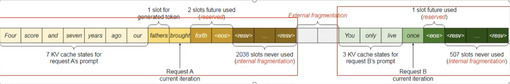

- 分块存储
	- KV Cache划分为固定大小的Block（如16 tokens）
	- 通过Block Table映射逻辑地址到物理地址
	- 支持非连续存储

- 按需分配
	- 生成新token时才分配新Block
	- 序列结束后立即释放

- 内存共享
	- 相同前缀的请求共享KV Cache Block
	- Copy-on-Write机制：读共享，写复制

- 性能提升
	- 显存利用率：20-40% → 接近100%
	- 吞吐量提升2-4倍

### 5.5 Continuous Batching

- 传统Static Batching
	- 等待所有请求完成才处理下一批
	- 短请求等待长请求，资源浪费
	-  
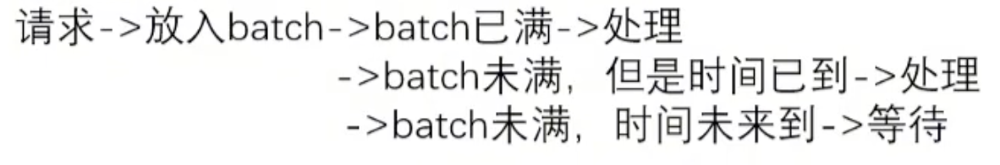
	-  
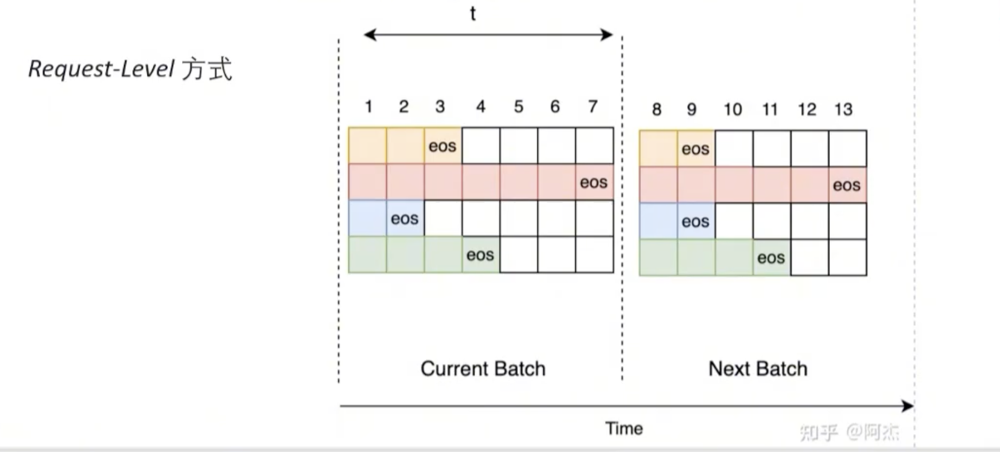

- Continuous Batching（动态批处理）
	- 请求完成立即移出，新请求立即加入
	- 动态调整batch组成
	- 显著提升GPU利用率

- 批处理优势
	- 多条数据只需加载一次模型参数，提高吞吐

### 5.6 解码策略

- 贪心解码（Greedy）：每步选概率最高的token

- 随机采样

	- Temperature：控制概率分布平滑度
		- T > 1：更均匀，增加多样性（概率变软）
		- T < 1：更尖锐，趋向贪心（概率变硬）
		- T = 0：等价于贪心解码

	- Top-K：只从概率最高的K个token中采样
		- 缺点：可能引入低概率词（如top2概率为0.9和0.01）

	- Top-P（Nucleus）：从累积概率达到P的最小token集合中采样
		- 动态调整候选集大小，更灵活

- Beam Search（集束搜索）
	- 保留K条最优路径（K为束宽beam width）
	- 全局最优与计算成本的折中
	- 缺点：不支持流式输出（需走完才能确定最优路径）

### 5.7 投机解码（Speculative Decoding）

- 原理：用小模型快速生成草稿，大模型并行验证

- 优势：减少大模型推理次数，加速2-3倍

## 六、vLLM推理引擎

### 6.1 编译安装

- SSL配置
	- 在setup.py中添加：
	- import ssl
	- ssl._create_default_https_context = ssl._create_unverified_context

- 安装命令
	- VLLM_USE_PRECOMPILED=1 uv pip install -e .
	- uv pip install torch torchvision torchaudio --index-url https://download.pytorch.org/whl/cu121

- 常见问题
	- AssertionError: distutils/core.py
	- 解决：export SETUPTOOLS_USE_DISTUTILS=stdlib

### 6.2 目录结构

- 核心组件

	- core：基础数据结构和抽象类（采样参数、调度器接口）

	- engine：推理引擎，协调请求调度、批处理、模型执行

	- executor：执行器，管理前向传播和计算资源

	- model_executor：模型加载、权重管理、推理计算

- 模型架构

	- attention：注意力机制实现（PagedAttention、Flash Attention）

	- transformers_utils：HuggingFace Transformers集成

	- multimodal：多模态输入处理

	- lora：LoRA适配器支持

- 分布式并行

	- distributed：多GPU/多节点并行计算和通信

	- worker：分布式环境下的任务分配和执行

- 接口适配

	- entrypoints：API入口（OpenAI兼容API、gRPC）

	- prompt_adapter：提示词格式转换

- 工具模块

	- spec_decode：投机解码实现

	- profiler：性能分析

	- plugins：插件扩展系统

### 6.3 LLM初始化

- 时序图
	-  
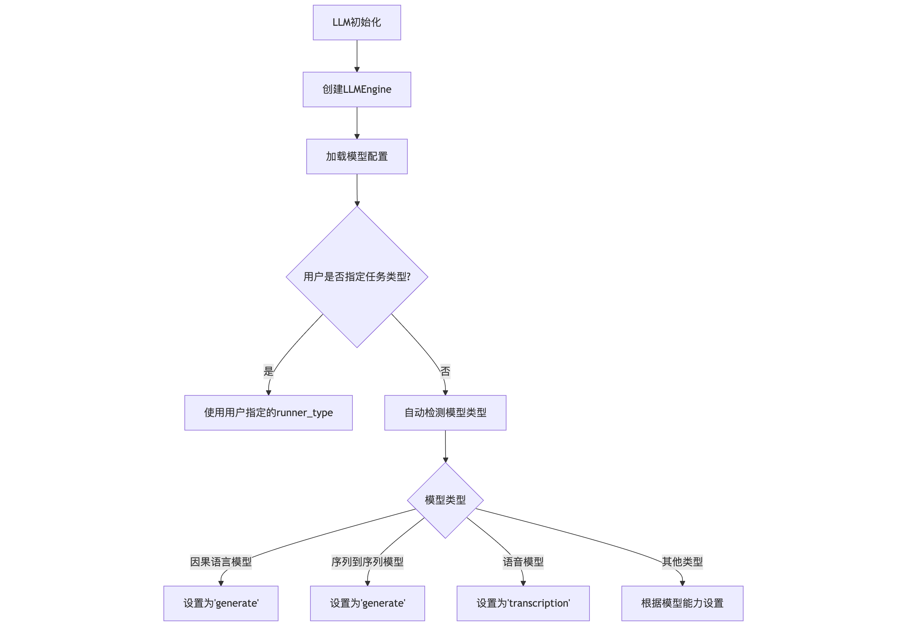

### 6.4 generate接口

- 功能：用于批量生成文本，接受提示(prompts)和生成参数，通过语言模型生成相应输出

- 核心参数

	- prompts（提示词）：文本提示，支持字符串或列表
		- 可以是单个字符串提示词，如 "Hello, my name is"
		- 也可以是提示词列表，如 ["The capital of France is", "The future of AI is"]
		- 支持多种格式的提示词输入（文本、token ID序列等）
		- 与 prompt_token_ids 参数互斥（只能使用其中一个）

	- sampling_params（采样参数）：控制文本生成过程的参数
		- temperature：随机性控制（0.0-2.0）
		- top_p：核采样阈值（0.0-1.0）
		- top_k：Top-K采样
		- max_tokens：最大生成长度
		- stop：停止词列表

	- prompt_token_ids：预编码的token ID，跳过分词
		- 替代 prompts 参数，直接提供 token ID
		- 可以是单个提示词的 token ID 列表
		- 也可以是多个提示词的 token ID 列表列表
		- 使用此参数可跳过分词步骤，提高效率

	- use_tqdm（进度条控制）
		- True: 显示默认进度条
		- False: 不显示进度条
		- 可传入自定义的 tqdm 构造函数

	- lora_request：LoRA适配器配置
		- LoRA (Low-Rank Adaptation) 是一种轻量级微调技术
		- 允许在不修改原始模型权重的情况下适配模型
		- 可以是单个 LoRA 请求或多个请求的列表

	- prompt_adapter_request：提示适配器请求
		- 提示适配器用于动态修改输入提示
		- 支持模板化提示、上下文注入等高级功能

	- guided_options_request：约束解码（JSON Schema、正则表达式）
		- 支持基于语法、正则表达式等的约束生成
		- 示例: 强制生成符合特定格式的文本（如 JSON、XML）

	- priority（请求优先级）
		- 仅当启用优先级调度策略时有效
		- 数值越大优先级越高

- 返回值：List[RequestOutput]
	- 示例：[RequestOutput(prompt="Hello, my name is", outputs=[Output(text=" John", token_ids=[...])])]

- 内部流程_validate_and_add_requests
	- 将用户请求添加到处理引擎
	- 流程图
		-  
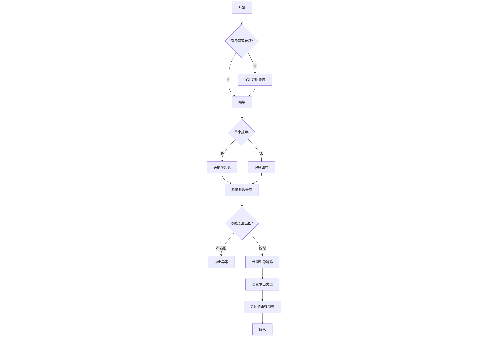

- 时序图
	-  
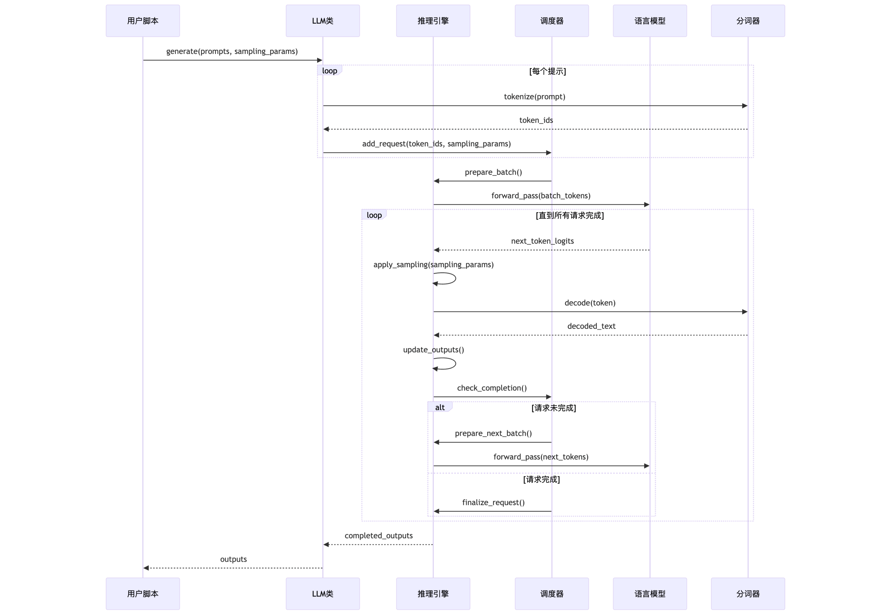

## 七、RAG（检索增强生成）

### 7.1 解决的问题

- 知识时效性：训练数据有截止日期

- 幻觉问题：生成不存在的事实

- 垂直领域：通用模型专业知识不足

- 成本问题：微调成本高，效果不确定

### 7.2 系统架构

- 核心公式：RAG = 检索器 + 生成器（推理能力+记忆力=人工智能）

- 基础架构图
	-  
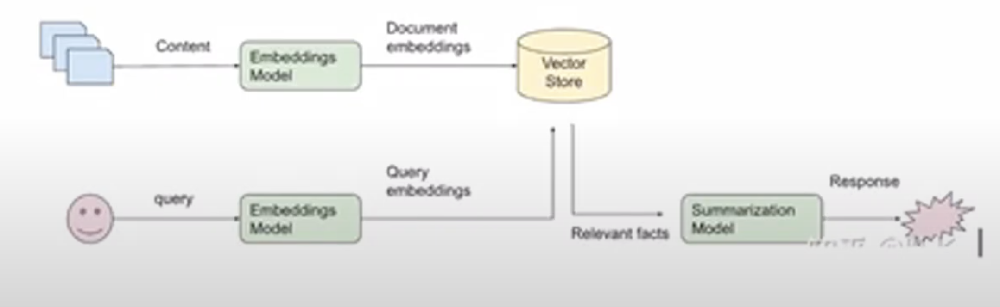

- 完整流程图
	-  
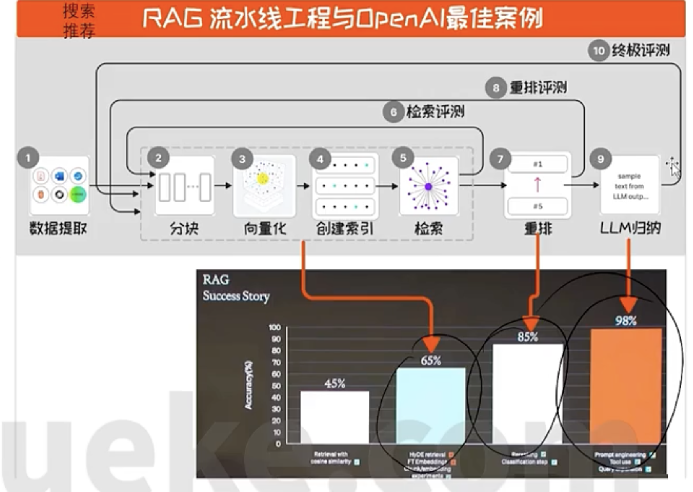

- 流程
	- 用户Query → 向量化 → 检索相关文档 → 构建Prompt → LLM生成
	- 提示词：问题和知识库里检索的答案，一并作为提示词传入大模型

### 7.3 文档处理

- 支持格式：PDF、Word、PPT、Excel、HTML、Markdown

- 切分策略

	- 固定长度切分：按字符/token数

	- 语义切分：按段落、句子、知识点

	- 递归切分：先大块后小块

	- 重叠切分：相邻chunk有重叠，保持上下文连贯
		- 切分原因：大模型输入长度有限制
		- 通常分片时，会带上下一段一部分，缓减知识点被分割的可能

### 7.4 向量检索

- 相似度度量
	- 余弦相似度（推荐）
	- 欧氏距离
	- 内积

- 稀疏检索
	- TF-IDF
	- BM25

- 混合检索：稀疏 + 稠密检索结合

### 7.5 重排序（Rerank）

- 作用：对召回结果精排，提升相关性

- 方法
	- Cross-Encoder：将Query和Doc拼接，输出相关性分数
	- 代表模型：bge-reranker、cohere-rerank
	- 说明：将召回的知识和用户问题通过专用model处理，得到分数排序

### 7.6 高级检索技术

- 知识图谱检索
	- 实体→节点，关系→边
	- 支持多跳推理
	- 特别适合多跳问题，利用知识关系提高相关度

- 子查询分解
	- 复杂问题拆分为多个子问题
	- 分别检索后聚合
	- 可使用树查询、向量查询等多种策略

- 树索引
	- 把节点以及对应的子节点知识都召回

- 关键词索引
	- 每个知识点对应几个关键词，用户问题命中关键词就召回对应节点

### 7.7 HyDE（Hypothetical Document Embeddings）

- 核心思想：生成假设答案辅助检索（抄作业的方式）

- 流程
	-  
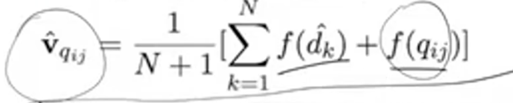
	- Step 1：LLM根据用户query生成k个"假答案"（单纯的大模型对query的理解）
	- Step 2：将k个假答案和query向量化
	- Step 3：将k+1个向量取平均得到融合向量v
	- Step 4：用融合向量v从文档库召回答案

- 优势：融合向量既有问题信息，也有答案模式信息，增强召回效果

### 7.8 多轮对话

- 上下文关联判断：分类模型判断是否需要历史上下文

- 长对话处理：LLM提取摘要压缩历史

## 八、多模态

### 8.1 Vision Transformer（ViT）

- 核心思想：将图像切分为Patch，作为序列输入Transformer

- 架构
	-  
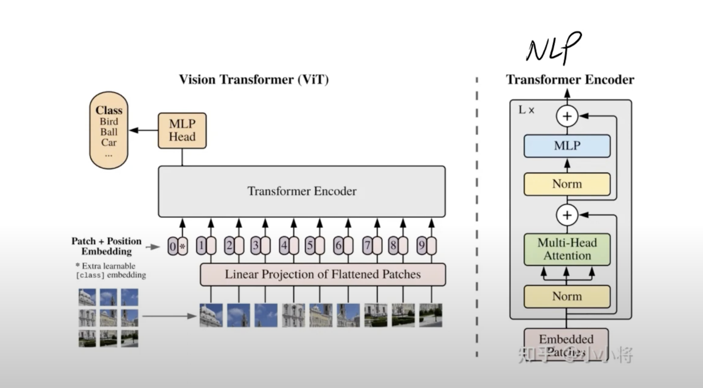

	- Patch Embedding：将16×16 patch映射为向量

	- Position Embedding：添加位置信息
		-  
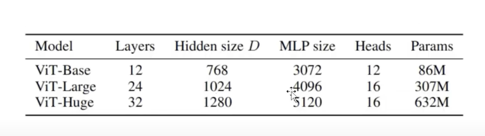
		-  
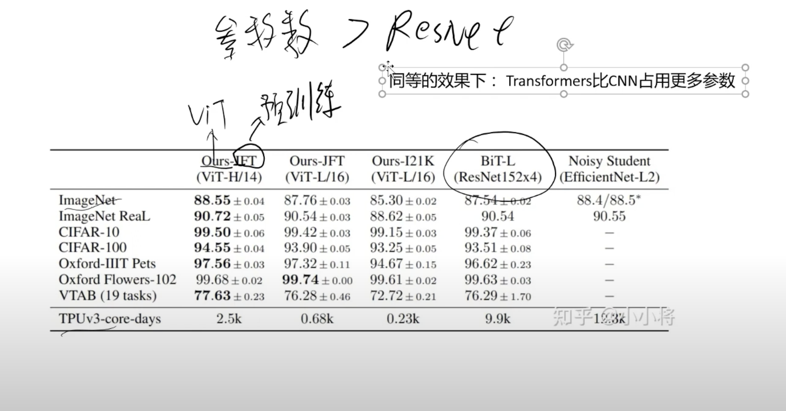

	- Transformer Encoder：标准Transformer层

	- Classification Head：[CLS] token分类

- 位置编码

	- 无Position Embedding：模型对位置不敏感，无法区分序列中元素位置差异（不可取）

	- 1D Position Embedding（推荐）：patch按行展开为1D序列，效果比2D好

	- 2D Position Embedding：保留2D空间位置，考虑图像块在二维空间的位置（x, y坐标）

	- 相对位置编码：编码patch间相对位置

### 8.2 CNN vs Transformer

- CNN
	- 局部感受野，需要深层网络捕获全局
	- 归纳偏置强（平移不变性、局部性）
	- 计算效率高
	- 纯CV场景还是用CNN，毕竟CNN快且便宜

- Transformer
	- 全局感受野，直接建模长程依赖
	- 归纳偏置弱，需要更多数据
	- 与NLP统一架构，便于多模态融合
	- 最大优势：NLP也用transformers，CV和NLP可以结合起来

### 8.3 CLIP

- 解决的问题
	- 传统分类模型类别固定
	- 迁移能力差
	- 标注成本高
	- 类别互斥（softmax）

- 双塔架构
	-  
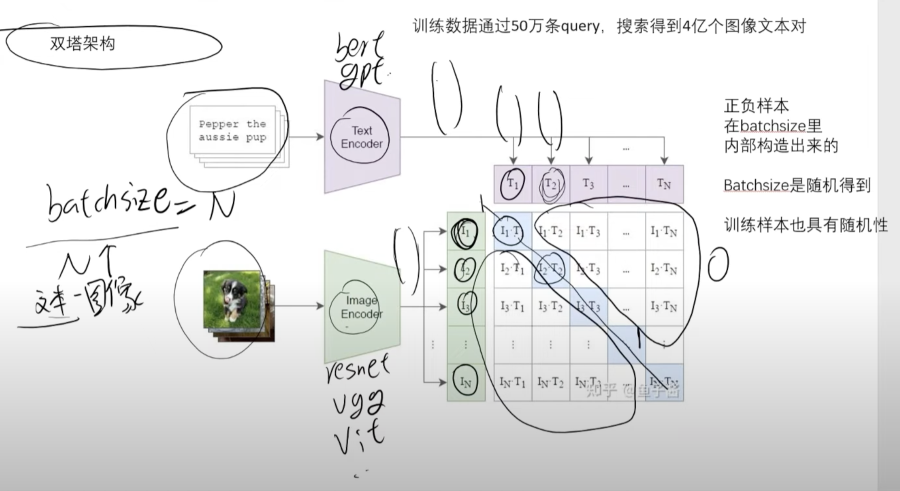
	- Image Encoder：ViT或ResNet
	- Text Encoder：Transformer
	- 对比学习：最大化配对图文相似度

- 训练
	- 数据：4亿图文对
	- 损失：InfoNCE对比损失

### 8.4 CLIP负样本构建

- Batch内负样本：除对角线外均为负样本
	-  
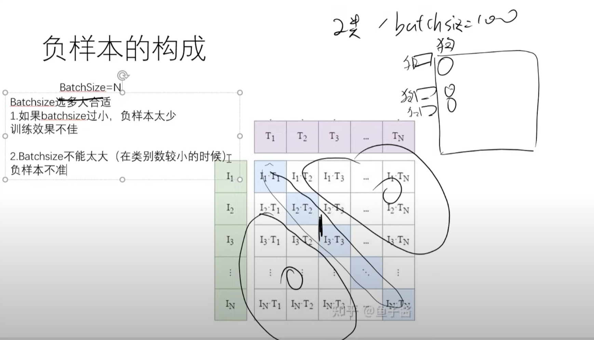

- BatchSize选择考量
	- 过小：负样本太少，训练效果不佳
	- 过大（类别数小时）：负样本不准确
	- 示例：识别狗时，负样本可能也是狗（只是不同的狗），导致负样本质量下降

### 8.5 CLIP Zero-Shot分类

-  
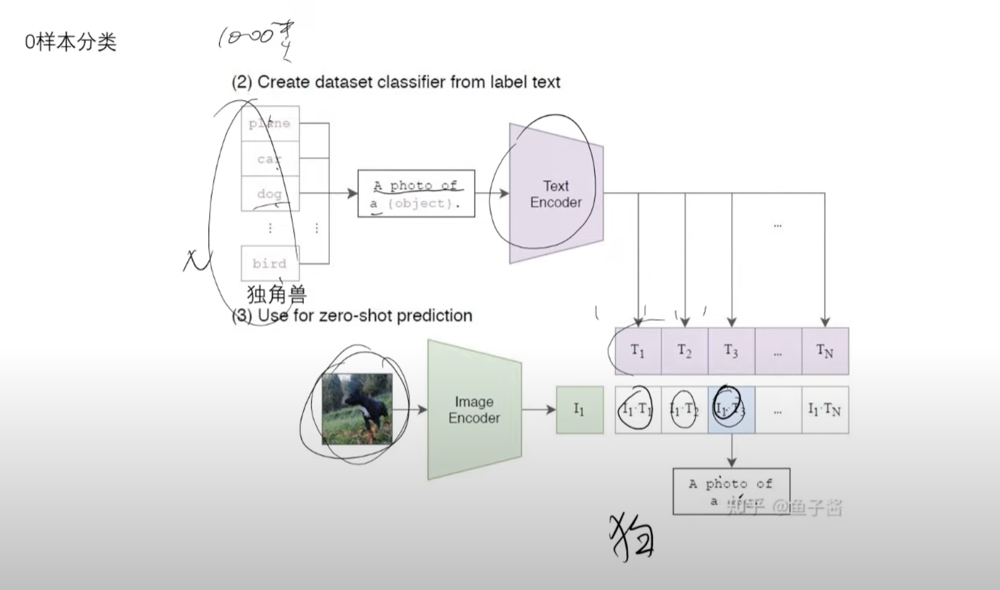

- 将类别名转为文本描述

- 计算图像与所有类别文本的相似度

- 选择最相似的类别

- 能够zero-shot识别的原因
	- 训练集够大，包含类似图像分布和相近概念
	- 将分类问题转换为检索问题

### 8.6 SAM（Segment Anything Model）

- Meta开发的通用图像分割模型，可对图像中任意对象进行分割

- 计算机视觉任务技术路线
	- 目标分割 → 目标检测 → 目标识别 → 目标跟踪
	- 目标分割：像素级区分前景和背景，聚焦目标区域
	- 目标检测：定位目标，确定"目标在哪、有多大"
	- 目标识别：定性目标，回答"目标是什么"
	- 目标跟踪：追踪目标运动轨迹

- 特点
	- 零样本分割
	- 多种Prompt：点、框、文本、粗糙Mask

- 架构

	- 整体流程图
		-  
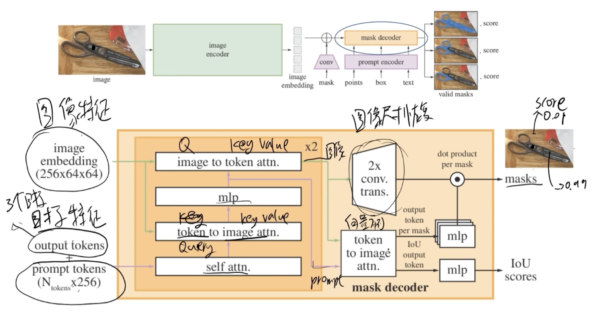

	- Image Encoder
		- ViT-H（MAE预训练）
		- 输出：256×64×64特征图
		-  
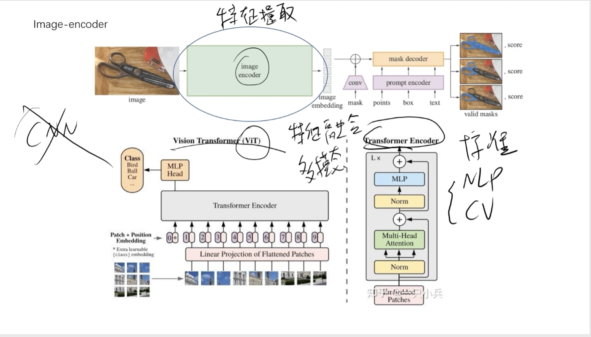

	- Prompt Encoder
		- 点/框：位置编码 + 类型编码
		- 文本：CLIP文本编码器
		- Mask：卷积下采样
		-  
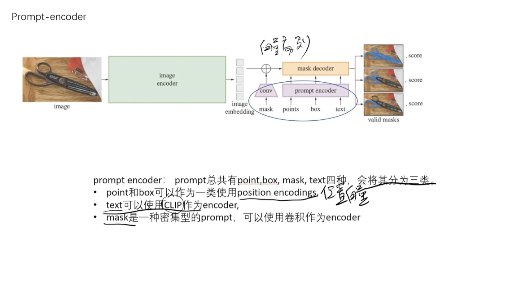

	- Mask Decoder
		-  
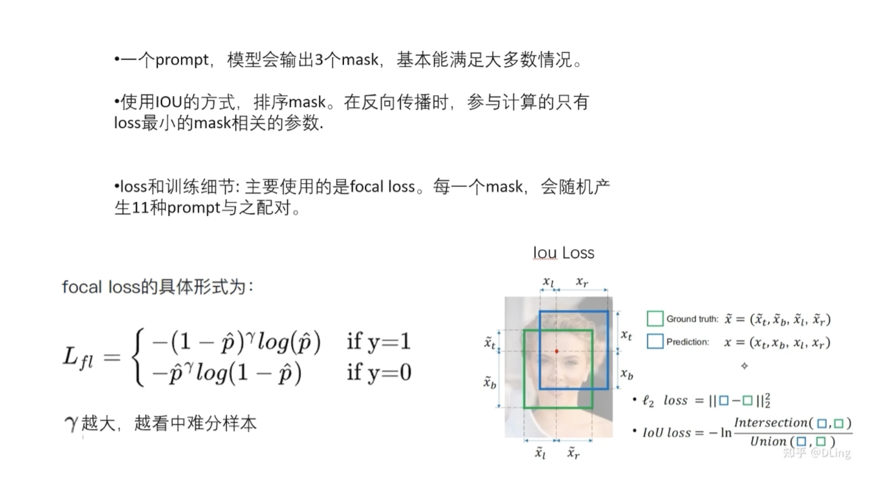
		-  
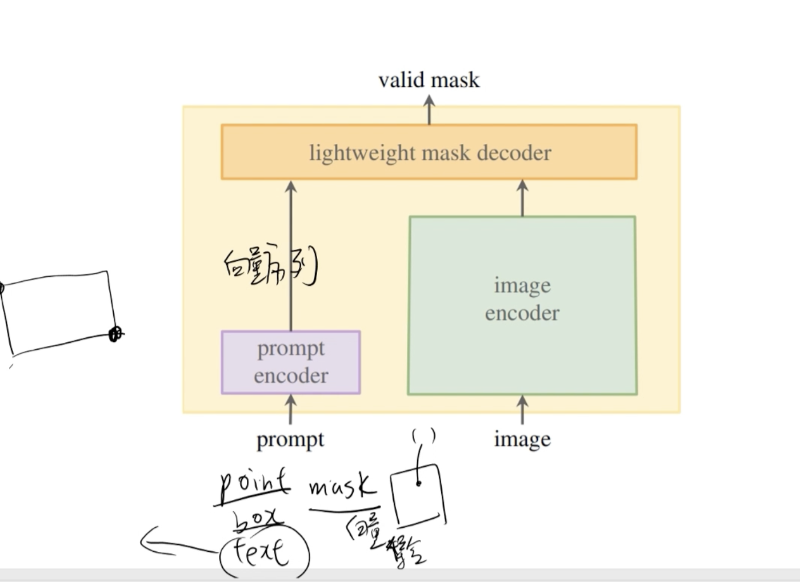
		- 双向Cross-Attention
		- 输出：多个Mask + IoU分数

- 数据引擎
	- 手动阶段：人工标注 + 模型辅助
	- 半自动阶段：模型预测 + 人工补充
	- 全自动阶段：模型自动生成 + 质量过滤

### 8.7 多模态大模型

- BLIP/BLIP-2：图文理解与生成
	-  
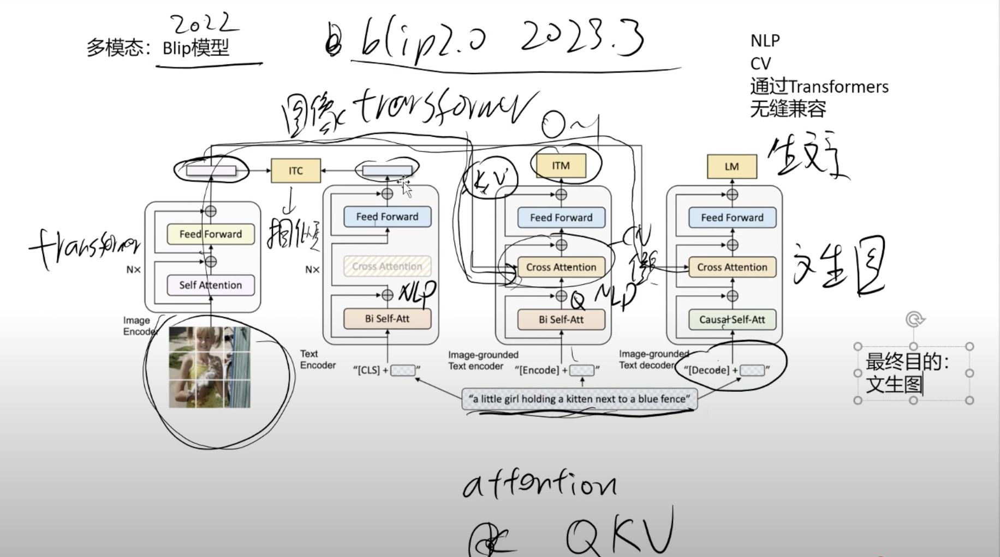

- LLaVA：视觉指令微调

- GPT-4V/Gemini：原生多模态大模型

### 8.8 目标检测应用

-  
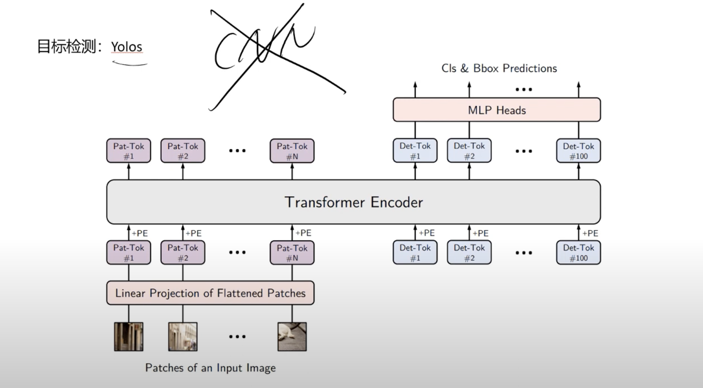

- 输入层附近：提取边缘（轮廓线条）、纹理（毛发纹理）等基础特征

- 输出层附近：整合这些特征，主观给出分类结论

## 九、模型量化

### 9.1 量化基础

- 量化原理图
	-  
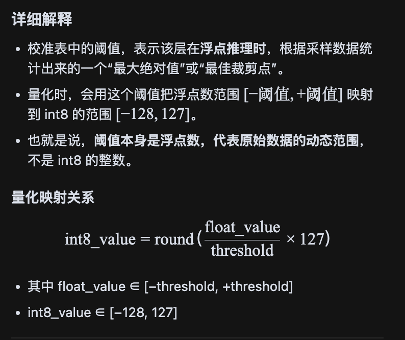

- 目的：降低模型存储和计算开销

- 类型
	- 权重量化：W8A16、W4A16
	- 激活量化：W8A8
	- KV Cache量化

- 精度
	- INT8：8位整数
	- INT4：4位整数
	- FP8：8位浮点

### 9.2 量化方法

- PTQ（Post-Training Quantization）
	- 训练后量化，无需重新训练
	- 代表：GPTQ、AWQ、SmoothQuant

- QAT（Quantization-Aware Training）
	- 训练时模拟量化
	- 精度损失小，成本高

### 9.3 TPU-MLIR

- 功能：将MLIR模型量化编译为TPU可执行格式

- 部署命令
	- model_deploy.py --mlir model.mlir --quantize INT8 --calibration_table cali_table --processor bm1684x --model output.bmodel

- 可视化
	- visual.py --f32_mlir model.mlir --quant_mlir model_int8.mlir --input input.npz

## 十、Agent与工具调用

### 10.1 角色智能体构建

- 基座模型选择：算力允许下越大越好

- 数据集构建
	- 非结构化：书籍、规章、百科
	- 结构化：对话数据集（10条以上，多多益善）

- 角色设定
	- 人设描述
	- 背景知识
	- 知识图谱（可选）

- 训练策略
	- 先训练非结构化数据（知识注入）
	- 再训练对话数据（风格对齐）

- 部署方式
	- 直接推理
	- 结合RAG增强知识

### 10.2 MCP（Model Context Protocol）

- 架构图
	-  

- 解决的问题
	- 工具描述标准化
	- 工具变更同步
	- 调用方式统一

- 架构
	- Client：LLM应用
	- Server：工具提供方
	- Protocol：JSON-RPC 2.0

## 十一、Scaling Law

### 11.1 核心发现

- Scaling Law示意图
	-  
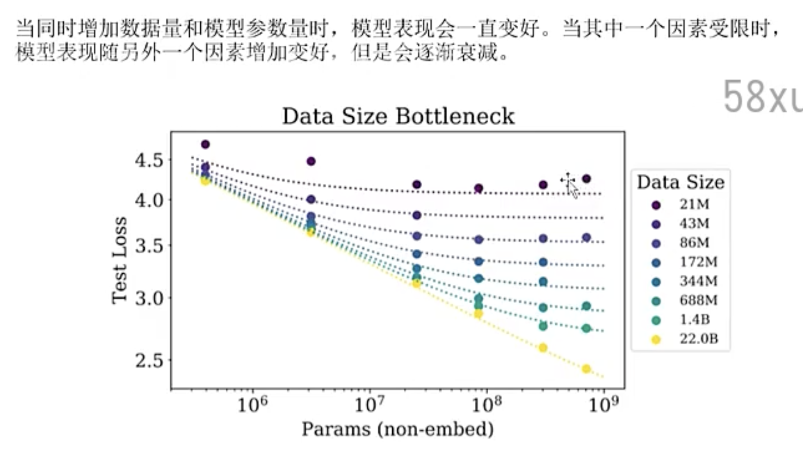

- 模型性能与三要素的幂律关系
	- 模型参数量N
	- 训练数据量D
	- 计算量C

- 公式：L(N,D) ∝ N^(-α) + D^(-β)

- 木桶效应
	- 当同时增加数据量和模型参数时，模型表现会一直变好
	- 当其中一个因素受限时，模型表现随另一因素增加变好，但会逐渐衰减
	- 在算力不足下，小模型收敛更快；但大模型效果上限更高（损失函数更小）

### 11.2 Chinchilla Law

- 最优配置：参数量和数据量应同步扩展

- 经验法则：1B参数约需20B tokens

### 11.3 涌现能力（Emergent Abilities）

- 定义：小模型不具备、大模型突然出现的能力

- 典型能力
	- 思维链推理（Chain-of-Thought）
	- 上下文学习（In-Context Learning）
	- 指令遵循（Instruction Following）

## 十二、大模型发展脉络

### 12.1 大模型内核

-  
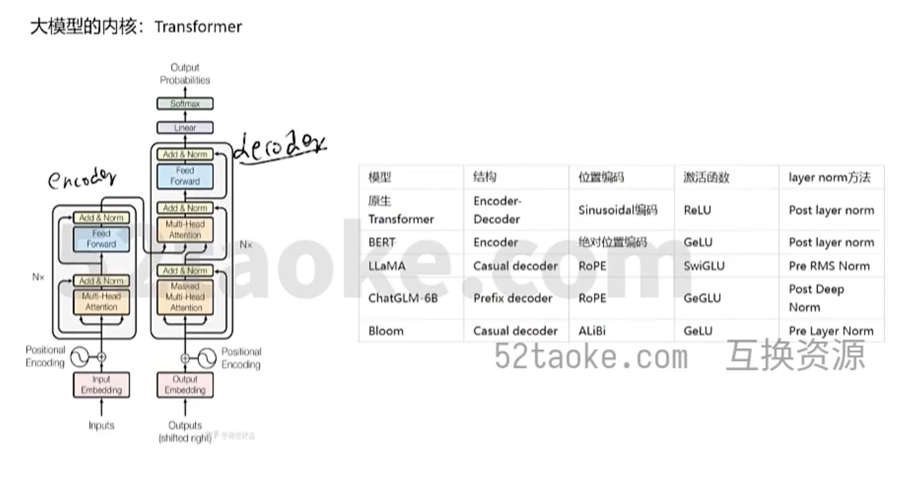

### 12.2 机器学习四个范式

-  
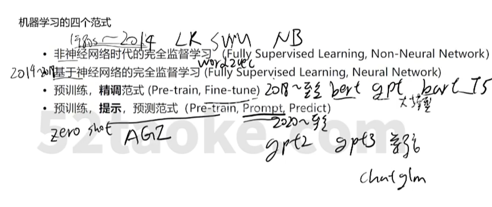

### 12.3 基于大模型的对话系统架构

-  
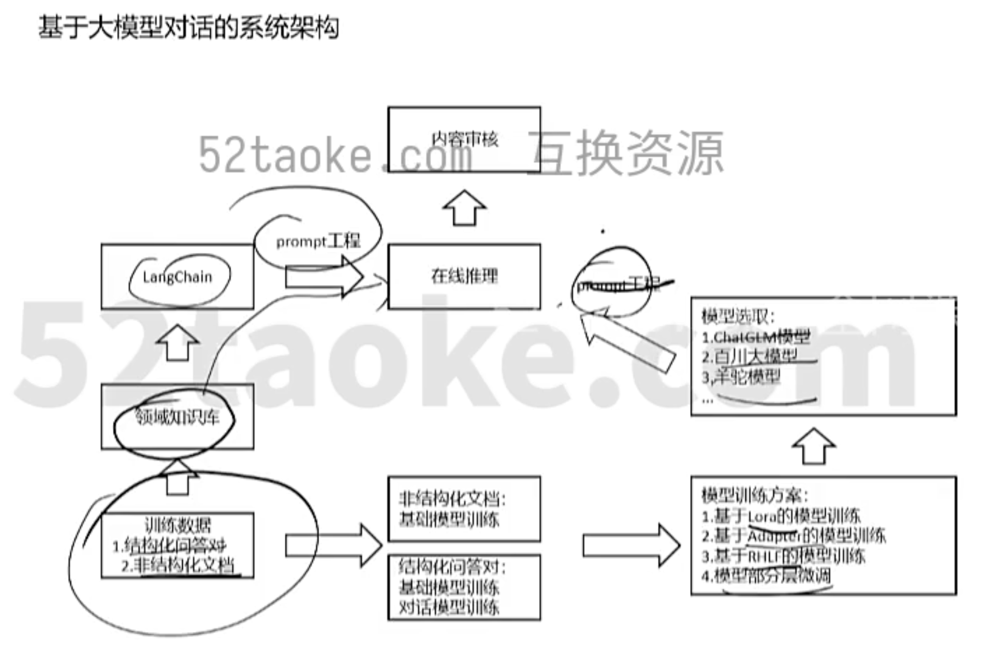

### 12.4 里程碑模型

- GPT系列：GPT-1 → GPT-2 → GPT-3 → GPT-4

- BERT系列：BERT → RoBERTa → ALBERT → DeBERTa

- 开源模型：LLaMA → LLaMA 2 → LLaMA 3

- 国产模型：ChatGLM、Qwen、Baichuan、DeepSeek

### 12.5 技术演进

- 注意力优化：MHA → MQA → GQA

- 位置编码：Sinusoidal → RoPE → ALiBi

- 归一化：Post-Norm → Pre-Norm → RMSNorm

- 激活函数：ReLU → GELU → SwiGLU
