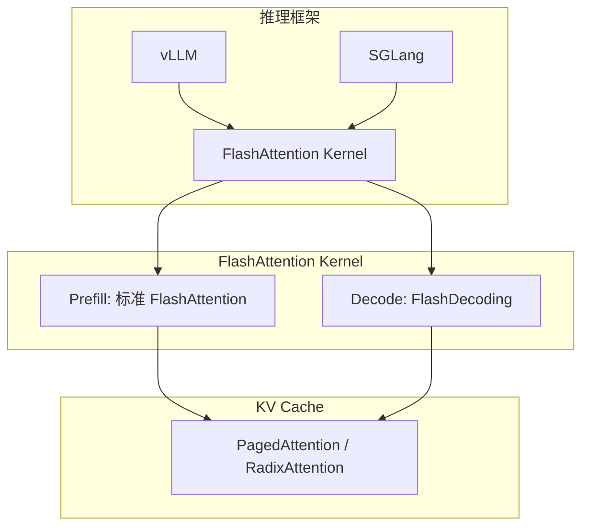

# 大模型推理技术分享 - Part 1: 关键基础概念

> **受众**: AI平台开发工程师
> **目标**: 深入理解大模型推理的核心技术原理

---

## 目录

0. [前置知识：Transformer 架构与原理](#0-前置知识transformer-架构与原理)
1. [KV Cache：推理加速的核心](#1-kv-cache推理加速的核心)
2. [Prefill vs Decode：两阶段推理](#2-prefill-vs-decode两阶段推理)
3. [FlashAttention：内存高效的注意力机制](#3-flashattention内存高效的注意力机制)
4. [Continuous Batching：动态批处理](#4-continuous-batching动态批处理)
5. [并行策略：TP、PP、DP](#5-并行策略tpppdp)
6. [推测解码：加速生成](#6-推测解码加速生成)

---

## 0. 前置知识：Transformer 架构与原理

> 本节为后续所有章节（KV Cache、Attention、并行策略等）的基础前置知识。如果你已经熟悉 Transformer，可以直接跳到第 1 节。

### 0.1 Transformer 是什么？

**一句话定义**：Transformer 是一种基于**注意力机制**（Attention）的深度学习模型架构，2017 年由 Google 在论文 *"Attention Is All You Need"* 中提出，是当前几乎所有大语言模型（GPT、Llama、DeepSeek 等）的基础架构。

**通俗类比**：

想象你在读一篇文章，理解当前这个词时，你的大脑会**同时参考**文章中所有其他词——有些词你会重点关注（注意力高），有些词你几乎忽略（注意力低）。Transformer 就是用数学公式模拟了这个过程。

```
传统模型（RNN）：像一个人从左到右逐字阅读，读到后面忘了前面
  "我" → "今天" → "去" → "北京" → "参加" → "会议"
   ↓       ↓      ↓      ↓       ↓       ↓
  串行处理，远距离信息容易丢失

Transformer：像一个人同时看到整段话，直接找到关键词之间的关系
  "我 今天 去 北京 参加 会议"
   ↕   ↕   ↕   ↕    ↕    ↕
  所有词同时互相关注，并行处理
```

### 0.2 Transformer 整体架构

原始 Transformer 包含 **Encoder（编码器）** 和 **Decoder（解码器）** 两部分，但当前主流大语言模型（GPT、Llama 等）**只使用 Decoder 部分**（称为 Decoder-Only 架构）。

```
┌─────────────────────────────────────────────────────────────┐
│                    Transformer（完整版）                       │
│                                                              │
│  ┌──────────────┐                    ┌──────────────┐        │
│  │   Encoder     │                    │   Decoder     │        │
│  │  （理解输入）  │ ──── 上下文 ────→  │  （生成输出）  │        │
│  │              │                    │              │        │
│  │  用途：       │                    │  用途：       │        │
│  │  BERT、翻译   │                    │  GPT、Llama   │        │
│  └──────────────┘                    └──────────────┘        │
│                                                              │
│  当前大模型主流：只用 Decoder（Decoder-Only）                   │
└─────────────────────────────────────────────────────────────┘
```

| 架构类型 | 代表模型 | 特点 |
|---------|---------|------|
| **Encoder-Only** | BERT、RoBERTa | 擅长理解（分类、抽取），双向注意力 |
| **Encoder-Decoder** | T5、BART、原始 Transformer | 翻译、摘要等 seq2seq 任务 |
| **Decoder-Only** | **GPT、Llama、DeepSeek** | 当前主流，自回归生成，单向注意力 |

### 0.3 Decoder-Only 的内部结构（以 Llama 为例）

一个 Decoder-Only Transformer 由 **N 层相同的解码层** 堆叠而成，每一层包含两个核心模块：

```
输入 tokens: "今天天气"
       ↓
┌──────────────────────────────────┐
│  Embedding（词嵌入层）             │  将每个 token 转换为向量
│  "今天" → [0.3, -0.1, 0.8, ...]  │  （查表操作，每个词对应一个向量）
│  "天气" → [0.1, 0.6, -0.2, ...]  │
└──────────────────────────────────┘
       ↓
┌──────────────────────────────────┐
│  Positional Encoding（位置编码）   │  告诉模型每个词的位置
│  "今天"在第1位，"天气"在第2位      │  （否则模型不知道词序）
└──────────────────────────────────┘
       ↓
╔══════════════════════════════════╗
║  Decoder Layer × N（重复 N 层）   ║  Llama-7B: N=32, Llama-70B: N=80
║  ┌────────────────────────────┐  ║
║  │ ① 自注意力（Self-Attention）│  ║  每个词关注所有历史词
║  │    + 残差连接 + LayerNorm   │  ║
║  ├────────────────────────────┤  ║
║  │ ② 前馈网络（FFN）           │  ║  对每个位置独立做非线性变换
║  │    + 残差连接 + LayerNorm   │  ║
║  └────────────────────────────┘  ║
╚══════════════════════════════════╝
       ↓
┌──────────────────────────────────┐
│  LM Head（语言模型头）             │  将向量映射回词表
│  输出概率分布 → 选择下一个 token   │  如："很" (0.3), "不" (0.2), ...
└──────────────────────────────────┘
       ↓
输出: "很好"
```

### 0.4 两大核心模块详解

#### ① 自注意力机制（Self-Attention）

这是 Transformer 最核心的创新。自注意力让模型在处理每个词时，能够**动态地关注输入中所有其他词**，并根据相关性分配不同的权重。

**直觉理解**：

```
句子: "小明 把 球 踢 给 了 小红"

当模型处理 "踢" 这个词时：
  "小明" ← 注意力 0.35（谁踢的？重点关注！）
  "把"   ← 注意力 0.05（语法词，不太重要）
  "球"   ← 注意力 0.30（踢什么？重点关注！）
  "踢"   ← 注意力 0.10（自身）
  "给"   ← 注意力 0.05
  "了"   ← 注意力 0.02
  "小红" ← 注意力 0.13（踢给谁？也要关注）
```

**计算过程（Q、K、V 三兄弟）**：

每个词被转换为三个向量（详细的数值计算示例见 [1.1 节](#11-为什么需要-kv-cache)）：

```
对于每个 token 的嵌入向量 x：
  Q (Query)  = x @ W_q   →  "我在找什么信息？"（查询）
  K (Key)    = x @ W_k   →  "我能提供什么信息？"（索引）
  V (Value)  = x @ W_v   →  "我的实际内容是什么？"（值）

注意力计算：
  Attention(Q, K, V) = softmax(Q @ Kᵀ / √d) @ V
                              ↑ 相关性打分    ↑ 按分数提取信息
```

**为什么除以 √d？** 点积的值会随着维度 d 增大而增大（因为是 d 个乘积之和），如果不缩放，softmax 的输入值过大会导致梯度消失（所有注意力集中到一个词上）。除以 √d 是一种归一化手段，让数值保持在合理范围。

#### 多头注意力（Multi-Head Attention）

实际中不只算一次 attention，而是**并行计算多个 attention（多个"头"）**，每个头关注不同的语义关系：

```
假设 hidden_size = 512, num_heads = 8, 则每个 head_dim = 64

Head 1: 关注语法关系（主语-谓语）
Head 2: 关注指代关系（代词-实体）
Head 3: 关注时间关系
Head 4: 关注因果关系
...（每个头自动学习关注什么）

最终: 将 8 个头的输出拼接（concat）→ 过一个线性投影 W_o
  MultiHead = concat(Head₁, Head₂, ..., Head₈) @ W_o
```

> 这就是 [1.3.1 节](#131-注意力变体mha--mqa--gqa) 中 MHA、GQA、MQA 讨论的基础。

#### ② 前馈网络（FFN / MLP）

每一层中，自注意力之后是一个**前馈网络**（Feed-Forward Network），对每个位置独立做非线性变换：

```python
# 标准 FFN（两层线性变换 + 激活函数）
def ffn(x):
    # x: [seq_len, hidden_size]
    hidden = relu(x @ W_up)    # 升维: [hidden_size] → [intermediate_size]
    output = hidden @ W_down   # 降维: [intermediate_size] → [hidden_size]
    return output

# Llama 使用 SwiGLU 变体（多一个门控矩阵）
def swiglu_ffn(x):
    gate = silu(x @ W_gate)    # 门控信号
    up = x @ W_up              # 升维
    hidden = gate * up         # 逐元素相乘（门控）
    output = hidden @ W_down   # 降维
    return output
```

**作用**：如果说自注意力是"从其他词收集信息"，那 FFN 就是"消化和整合这些信息"。它负责**非线性变换和知识存储**——研究表明，模型学到的事实性知识大部分存储在 FFN 的权重中。

**参数占比**：FFN 的参数量通常是整个模型的 **~2/3**（因为 intermediate_size 通常是 hidden_size 的 2.7~4 倍）。

#### 残差连接（Residual Connection）+ 层归一化（LayerNorm）

每个子模块（Self-Attention、FFN）都包裹着**残差连接**和**层归一化**：

```
output = LayerNorm(x + SubLayer(x))
              ↑        ↑
         归一化     残差：直接把输入加到输出上
```

- **残差连接**：解决深层网络的梯度消失问题。即使 SubLayer 学废了（输出 ≈ 0），信息也能通过 `+ x` 这条"高速公路"传递下去
- **层归一化**：稳定每层输出的数值范围，加速训练收敛

### 0.5 自回归生成：一次一个 token

Decoder-Only 模型的生成方式是**自回归（Auto-Regressive）**：每次只生成一个 token，然后把它追加到输入中，再生成下一个。

```
用户输入: "中国的首都是"

Step 1: 输入 "中国的首都是"  → 模型输出概率分布 → 采样得到 "北"
Step 2: 输入 "中国的首都是北" → 模型输出概率分布 → 采样得到 "京"
Step 3: 输入 "中国的首都是北京" → 模型输出概率分布 → 采样得到 "。"
Step 4: 输入 "中国的首都是北京。" → 模型输出 <EOS>（结束符）→ 停止

最终输出: "北京。"
```

**因果掩码（Causal Mask）**：在自回归生成中，模型只能看到**当前位置及之前**的 token，不能

### 1.1 为什么需要 KV Cache？

**问题背景**：
- Transformer 的自回归生成：每次生成一个 token，需要用到所有历史 token
- 朴素实现：每次都重新计算所有历史 token 的 Key 和 Value
- **时间复杂度**：生成 n 个 token 需要 O(n²) 次计算

**示例**：生成 "Hello world"
```
Step 1: 输入 "Hello"     → 计算 K₁, V₁ → 生成 " "
Step 2: 输入 "Hello "    → 重新计算 K₁, V₁, K₂, V₂ → 生成 "world"
Step 3: 输入 "Hello world" → 重新计算 K₁, V₁, K₂, V₂, K₃, V₃ → ...
```

#### K、V 的详细计算过程

每个 token 的 K 和 V 是通过**线性投影矩阵**（即可学习的权重矩阵）从 token 的嵌入向量计算而来的：

```
Token embedding（词嵌入向量）:  x ∈ [1, hidden_size]
权重矩阵:
  W_q ∈ [hidden_size, hidden_size]   ← Query 投影矩阵
  W_k ∈ [hidden_size, hidden_size]   ← Key 投影矩阵
  W_v ∈ [hidden_size, hidden_size]   ← Value 投影矩阵

计算:
  Q = x @ W_q    ← Query 向量（"我在找什么"）
  K = x @ W_k    ← Key 向量（"我能提供什么"）
  V = x @ W_v    ← Value 向量（"我的实际内容"）
```

**以生成 "Hello world" 为例（假设 hidden_size = 4，简化演示）**：

```
═══════════════════════════════════════════════════════════════
Step 1: 输入 "Hello"
═══════════════════════════════════════════════════════════════

1) Token "Hello" 经过 Embedding 层查表，得到嵌入向量:
   x₁ = [0.3, -0.1, 0.8, 0.5]       ← 从 Embedding 矩阵查出

2) 通过三个权重矩阵做线性投影（矩阵乘法）:

   Q₁ = x₁ @ W_q = [0.3, -0.1, 0.8, 0.5] @ [[...],   = [0.7, 0.2, -0.3, 0.9]
                                               [...],
                                               [...],
                                               [...]]

   K₁ = x₁ @ W_k = [0.3, -0.1, 0.8, 0.5] @ [[...],   = [0.5, -0.4, 0.6, 0.1]
                                               [...],      ↑ 这就是 K₁
                                               [...],
                                               [...]]

   V₁ = x₁ @ W_v = [0.3, -0.1, 0.8, 0.5] @ [[...],   = [0.2, 0.8, -0.1, 0.3]
                                               [...],      ↑ 这就是 V₁
                                               [...],
                                               [...]]

3) 自注意力计算（只有 1 个 token，与自己做 attention）:
   score = Q₁ @ K₁ᵀ = 0.7×0.5 + 0.2×(-0.4) + (-0.3)×0.6 + 0.9×0.1 = 0.18
   attn_weight = softmax([0.18]) = [1.0]    ← 只有一个 token，权重为 1
   output = 1.0 × V₁ = [0.2, 0.8, -0.1, 0.3]

4) output 经过后续层 → 预测下一个 token → " "（空格）

═══════════════════════════════════════════════════════════════
Step 2: 输入 "Hello "（朴素方式，无 KV Cache）
═══════════════════════════════════════════════════════════════

1) 两个 token 各自查 Embedding 表:
   x₁ = [0.3, -0.1, 0.8, 0.5]      ← "Hello" 的嵌入（和 Step 1 完全一样！）
   x₂ = [0.1, 0.6, -0.2, 0.4]      ← " " 的嵌入

2) 重新计算所有 token 的 Q、K、V（这就是浪费所在！）:
   K₁ = x₁ @ W_k = [0.5, -0.4, 0.6, 0.1]    ← 和 Step 1 算出的完全一样！
   V₁ = x₁ @ W_v = [0.2, 0.8, -0.1, 0.3]     ← 和 Step 1 算出的完全一样！
   K₂ = x₂ @ W_k = [-0.1, 0.3, 0.4, 0.7]     ← 新 token 的 K
   V₂ = x₂ @ W_v = [0.6, -0.2, 0.5, 0.1]     ← 新 token 的 V
   Q₂ = x₂ @ W_q = [0.4, 0.1, 0.5, -0.2]     ← 当前 token 的 Q

3) 当前 token（" "）与所有历史 token 做 attention:
   scores = Q₂ @ [K₁, K₂]ᵀ = [Q₂·K₁, Q₂·K₂] = [0.37, 0.22]
   attn_weights = softmax([0.37, 0.22]) = [0.54, 0.46]
   output = 0.54 × V₁ + 0.46 × V₂
          = 0.54 × [0.2, 0.8, -0.1, 0.3] + 0.46 × [0.6, -0.2, 0.5, 0.1]
          = [0.384, 0.340, 0.176, 0.208]

4) output → 预测下一个 token → "world"
```

#### Attention 三步计算的底层逻辑

上面 Step 2 的第 3) 步包含三个核心操作，每一步都有清晰的数学动机：

**第一步：`scores = Q₂ @ [K₁, K₂]ᵀ` → 衡量"相关性"**

```
scores = [Q₂·K₁, Q₂·K₂] = [0.37, 0.22]
```

- Q₂ 代表当前 token（空格）的**"需求"**——"我需要什么样的上下文信息？"
- K₁、K₂ 代表每个历史 token 的**"标签"**——"我能提供什么信息？"
- **点积越大，说明两个向量方向越一致**，即"需求"与"供给"越匹配

> 🔑 **数学根源**：点积（dot product）在几何上等于 `|a|·|b|·cos(θ)`，cos(θ) 衡量两个向量的夹角。夹角越小 → cos 值越大 → 点积越大 → 越相关。这就是为什么用点积来打分。

**第二步：`attn_weights = softmax([0.37, 0.22])` → 归一化为概率分布**

```
softmax(xᵢ) = exp(xᵢ) / Σⱼ exp(xⱼ)

exp(0.37) = 1.448,  exp(0.22) = 1.246
softmax = [1.448/2.694, 1.246/2.694] = [0.54, 0.46]
```

为什么用 softmax 而不是简单的归一化（除以总和）？

| 特性 | 简单归一化 | Softmax |
|------|-----------|---------|
| 处理负数 | ❌ 可能出负权重 | ✅ 永远非负 |
| 放大差异 | ❌ 线性比例 | ✅ 指数函数放大差距 |
| 概率解释 | ❌ | ✅ 输出和为 1，可解释为概率 |

> 🔑 **核心思想**：softmax 让模型可以**"软"地选择**关注哪些 token——不是非此即彼的硬选择，而是给每个 token 分配一个关注比例。分数高的 token 分到更多注意力，但低分 token 也不会被完全忽略。

**第三步：`output = Σ(weight × V)` → 加权聚合信息**

```
output = 0.54 × V₁ + 0.46 × V₂ = [0.384, 0.340, 0.176, 0.208]
```

- V₁ 是 "Hello" 的**"内容/价值"**——它实际携带的语义信息
- V₂ 是 " " 的**"内容/价值"**
- 注意力权重决定了**从每个 token 提取多少信息**

> 🔑 **直觉**：就像人类阅读时的注意力机制——读到一个词时，你会**重点关注**与当前词最相关的那些词，最终理解 = 各个词的信息按重要程度**加权混合**。

**完整直觉总结（图书馆检索类比）**：

```
Q (Query)  = 你的"搜索关键词"（我想找什么？）
K (Key)    = 每本书的"索引标签"（这本书讲什么？）
V (Value)  = 每本书的"实际内容"（书里写了什么？）

Step 1: Q·K  → 用关键词匹配每本书的标签，得到相关性打分
Step 2: softmax → 把打分转换为"每本书该看多少"的比例
Step 3: Σ(w×V) → 按比例提取每本书的内容，融合成最终答案
```

**为什么要分 K 和 V 两套向量，而不合成一个？** 这是一个关键的设计决策——**"用什么匹配"和"提供什么信息"需要解耦**。一本书的**标题/关键词**（K）决定了它是否与你的查询相关，但你最终要读的是**书的内容**（V），不是标题。如果 K = V，就等于"用内容本身来判断相关性"，灵活度大大降低。分开后，模型可以自由学习：用什么特征来匹配（K），以及匹配上之后输出什么信息（V）。

**浪费在哪？** Step 2 中 K₁、V₁ 的计算与 Step 1 **完全相同**（因为 W_k、W_v 是固定权重，x₁ 也没变），但朴素实现还是重新算了一遍。随着序列变长，这种重复计算呈 O(n²) 增长——这正是 KV Cache 要解决的问题。

> **总结**：K 和 V 的本质就是 `token嵌入向量 × 权重矩阵` 的矩阵乘法结果。W_k、W_v 是模型训练时学到的参数（推理时固定不变），所以同一个 token 在同一层的 K、V 值永远不变，缓存后可以直接复用。

### 1.2 KV Cache 原理

**核心思想**：缓存已计算的 Key 和 Value，避免重复计算

```python
# 伪代码示例
class Attention:
    def __init__(self):
        self.kv_cache = {}  # 缓存 {position: (K, V)}
    
    def forward(self, x, position):
        # 计算当前 token 的 Q, K, V
        Q = self.W_q(x)
        K = self.W_k(x)
        V = self.W_v(x)
        
        # 保存到 cache
        self.kv_cache[position] = (K, V)
        
        # 从 cache 获取所有历史 K, V
        all_K = [self.kv_cache[i][0] for i in range(position + 1)]
        all_V = [self.kv_cache[i][1] for i in range(position + 1)]
        
        # 计算 attention
        # concat: 将缓存中零散的 K/V 向量列表拼接成完整矩阵
        # 例如 concat([K₀, K₁, K₂]) → 形状 [n+1, hidden] 的矩阵
        # 矩阵乘法 Q @ K.T 要求 K 是二维矩阵，所以必须先 concat
        scores = Q @ concat(all_K).T
        attn = softmax(scores) @ concat(all_V)
        return attn
```

**优化效果**：
- 时间复杂度：O(n²) → O(n)
- 生成 100 个 token：从 5050 次计算 → 100 次计算

### 1.3 KV Cache 的内存开销

**计算公式**：
```
KV Cache 大小 = 2 × num_layers × seq_len × hidden_size × precision
```

**各字段含义**：

| 字段 | 含义 | 说明 |
|------|------|------|
| **2** | K（Key）和 V（Value）两个缓存矩阵 | Q 是当前 token 即时计算的无需缓存，K 和 V 必须保留所有历史 token 的结果 |
| **num_layers** | Transformer 解码层数 | 每层自注意力模块有独立的 K、V 投影权重，不能跨层共享 |
| **seq_len** | 已生成/处理的 token 序列长度 | 自回归生成时每个新 token 需与所有历史 token 做注意力计算，缓存量随序列长度线性增长 |
| **hidden_size** | 隐藏层维度（K/V 向量维度） | 多头注意力中各头维度拼接后等于 hidden_size，决定单 token 单层缓存的"宽度" |
| **precision** | 每个参数占用的字节数 | FP16 = 2 bytes，FP32 = 4 bytes |

**公式推导**：自注意力中 Q 与 K 点积得到注意力权重，再与 V 加权求和得到输出。为了让新 token "看到"之前的上下文，必须缓存每一层、每个历史 token 位置的 K 和 V 向量，最后乘以精度得到实际字节数。

> **注意**：如果模型使用了 GQA（Grouped-Query Attention）或 MQA（Multi-Query Attention），K/V 的 head 数少于 Q 的 head 数，此时 `hidden_size` 应替换为 `num_kv_heads × head_dim`，KV Cache 会相应减小。详见下方 [1.3.1 注意力变体](#131-注意力变体mha--mqa--gqa)。

**示例**：Llama-2-7B
- num_layers = 32
- hidden_size = 4096
- seq_len = 2048
- precision = FP16 (2 bytes)

```
KV Cache = 2 × 32 × 2048 × 4096 × 2 bytes
         = 1,073,741,824 bytes
         ≈ 1 GB per request
```

**挑战**：
- 单个请求就需要 1GB 显存
- A100 (80GB) 理论上只能并发 80 个请求
- 实际更少（模型权重、激活值也需要显存）

#### 1.3.1 注意力变体：MHA → MQA → GQA

标准多头注意力（MHA）的 KV Cache 开销巨大，MQA 和 GQA 通过减少 K/V head 数来降低缓存量。

**MHA（Multi-Head Attention）**：原始 Transformer 设计，Q、K、V 各有 `num_heads` 个头。

```
Q heads:  [H1] [H2] [H3] [H4] [H5] [H6] [H7] [H8]
K heads:  [H1] [H2] [H3] [H4] [H5] [H6] [H7] [H8]
V heads:  [H1] [H2] [H3] [H4] [H5] [H6] [H7] [H8]
```

- 每个 Q head 与对应的 K、V head 做注意力计算
- KV Cache = `2 × num_layers × seq_len × num_heads × head_dim × precision`

**MQA（Multi-Query Attention）**：所有 Q head 共享同一组 K 和 V。

> 论文：*Fast Transformer Decoding: One Write-Head is All You Need*（Shazeer, 2019）

```
Q heads:  [H1] [H2] [H3] [H4] [H5] [H6] [H7] [H8]
K heads:  [          --------共享 1 个--------          ]
V heads:  [          --------共享 1 个--------          ]
```

- K、V 只有 1 个头，KV Cache 缩减为原来的 **1/num_heads**
- 优点：KV Cache 大幅减小，推理速度显著提升
- 缺点：表达能力下降，模型质量有一定损失
- 代表模型：PaLM、StarCoder、Falcon-40B

**GQA（Grouped-Query Attention）**：将 Q heads 分组，每组共享一份 K、V。

> 论文：*GQA: Training Generalized Multi-Query Transformer Models from Multi-Head Checkpoints*（Ainslie et al., 2023）

```
假设 num_heads=8，num_kv_heads=2（每 4 个 Q head 一组）

Q heads:  [H1] [H2] [H3] [H4] | [H5] [H6] [H7] [H8]
K heads:  [   共享 K1         ] | [   共享 K2         ]
V heads:  [   共享 V1         ] | [   共享 V2         ]
```

- KV Cache = `2 × num_layers × seq_len × num_kv_heads × head_dim × precision`
- 代表模型：Llama-2-70B（num_kv_heads=8）、Llama-3、Mistral-7B

**GQA 是 MHA 和 MQA 的统一框架**：

| 配置 | num_kv_heads | 等价于 |
|------|-------------|--------|
| `num_kv_heads = num_heads` | 如 32 | **MHA** |
| `1 < num_kv_heads < num_heads` | 如 8 | **GQA** |
| `num_kv_heads = 1` | 1 | **MQA** |

**KV Cache 节省对比**（Llama-2 系列，num_heads=32, head_dim=128, 32层, seq_len=2048, FP16）：

| 注意力类型 | num_kv_heads | KV Cache / 请求 | 节省比例 |
|-----------|-------------|-----------------|---------|
| MHA | 32 | 1 GB | 基准 |
| GQA | 8 | 0.25 GB | 75% |
| MQA | 1 | ~0.03 GB | 96.9% |

**选择策略**：
- 追求极致质量 → MHA
- 平衡质量与效率（当前主流）→ **GQA**
- 对延迟极度敏感 → MQA

### 1.4 KV Cache 管理策略

#### 1.4.1 vLLM: PagedAttention

**核心思想**：借鉴操作系统的虚拟内存管理

```
逻辑地址空间（连续）          物理地址空间（分散）
┌─────────────────┐          ┌─────┐
│ Token 0-15      │ ───────> │Block│ (GPU Memory)
├─────────────────┤          ├─────┤
│ Token 16-31     │ ───────> │Block│
├─────────────────┤          ├─────┤
│ Token 32-47     │ ───────> │Block│
└─────────────────┘          └─────┘
```

**特点**：
- 固定块大小（如 16 tokens）
- 块表（Block Table）映射逻辑地址到物理地址
- 支持块共享（前缀共享）
- 减少内存碎片

**代码示例**（vLLM）：
```python
class BlockSpaceManager:
    def __init__(self, block_size=16, num_blocks=1000):
        self.block_size = block_size
        self.free_blocks = list(range(num_blocks))
        self.block_tables = {}  # {seq_id: [block_ids]}
    
    def allocate(self, seq_id, num_tokens):
        num_blocks = (num_tokens + self.block_size - 1) // self.block_size
        blocks = [self.free_blocks.pop() for _ in range(num_blocks)]
        self.block_tables[seq_id] = blocks
        return blocks
    
    def free(self, seq_id):
        blocks = self.block_tables.pop(seq_id)
        self.free_blocks.extend(blocks)
```

#### 1.4.2 SGLang: RadixAttention

**核心思想**：使用 Radix Tree（前缀树）管理 KV Cache

```
示例：三个请求
- "Translate to French: Hello"
- "Translate to French: Goodbye"
- "Translate to Spanish: Hello"

Radix Tree:
Root
├─ "Translate to French: " (cached)
│   ├─ "Hello" (cached)
│   └─ "Goodbye" (cached)
└─ "Translate to Spanish: " (cached)
    └─ "Hello" (cached)
```

**特点**：
- 自动识别公共前缀
- 任意长度前缀（不限于固定块）
- 适合 Few-shot、多轮对话、Agent 场景
- LRU/LFU 驱逐策略

**代码示例**（SGLang）：
```python
class RadixCache:
    def __init__(self):
        self.root = TreeNode()
    
    def match_prefix(self, token_ids):
        """匹配最长公共前缀，返回匹配长度和最后匹配到的节点"""
        node = self.root       # 从根节点开始遍历
        matched_len = 0        # 已匹配的前缀长度
        
        for i, token_id in enumerate(token_ids):
            if token_id in node.children:
                # 当前 token 在树中存在，沿子节点继续向下匹配
                node = node.children[token_id]
                matched_len = i + 1  # i 从 0 开始，实际长度需 +1
            else:
                # KV Cache 必须从头连续才能复用，一旦断开后续无意义
                break
        
        # matched_len: 可复用的 KV Cache token 数
        # node: 最后匹配节点，供 insert 从此处继续插入后缀
        return matched_len, node
    
    def insert(self, token_ids, kv_data):
        """插入新的 KV Cache，复用已有前缀，只插入不匹配的后缀部分"""
        # 先查找已有前缀的匹配长度和终止节点
        matched_len, node = self.match_prefix(token_ids)
        
        # 从匹配终止位置开始，逐个插入剩余 token 作为新子节点
        for token_id in token_ids[matched_len:]:
            new_node = TreeNode(token_id)
            node.children[token_id] = new_node
            node = new_node  # 移动到新节点，为下一个 token 做准备
        
        # 在最后一个节点上存储对应的 KV Cache 数据
        node.kv_data = kv_data
```

**`match_prefix` 核心逻辑解析**：

该方法从根节点出发，逐个遍历输入 `token_ids`，沿前缀树向下查找最长连续匹配：

```
树中已有:  [Translate] → [to] → [French] → [:] → [Hello]
新请求:    [Translate] → [to] → [French] → [:] → [Goodbye]
                                              ↑
                                        匹配到这里断开，matched_len = 4
```

- **从根开始**：`node = self.root`，每步检查当前 token 是否在 `node.children` 中
- **匹配成功**：走到子节点，`matched_len = i + 1`（i 从 0 开始故 +1）
- **匹配失败**：`break` 终止。因为 KV Cache 必须从头连续才能复用，中间断开后续匹配无意义
- **返回 `(matched_len, node)`**：匹配长度用于确定可复用的 KV Cache 范围；返回的节点供 `insert` 方法从该位置继续插入不匹配的后缀，避免从根重新遍历
- **时间复杂度**：O(n)，n 为输入序列长度

### 1.5 对比总结

| 特性 | PagedAttention (vLLM) | RadixAttention (SGLang) |
|------|----------------------|------------------------|
| 数据结构 | Block Table | Radix Tree |
| 粒度 | 固定块（16 tokens） | 任意长度前缀 |
| 前缀共享 | 需要显式指定 | 自动识别 |
| 内存碎片 | 可能存在 | 更少 |
| 适用场景 | 通用推理 | Few-shot、对话、Agent |

---

## 2. Prefill vs Decode：两阶段推理

### 2.1 两阶段概述

**Prefill（预填充）**：
- 输入：完整的 prompt（如 100 个 tokens）
- 输出：第一个生成的 token
- 特点：**计算密集型**（Compute-bound）
- 并行度：高（所有 tokens 并行计算）

**Decode（解码）**：
- 输入：上一步生成的 token（1 个 token）
- 输出：下一个生成的 token
- 特点：**内存密集型**（Memory-bound）
- 并行度：低（只有 1 个 token）

### 2.2 计算特性对比

```
Prefill 阶段：
输入: [Token₁, Token₂, ..., Token₁₀₀]
     ↓ 并行计算 Attention
输出: Token₁₀₁

Decode 阶段：
输入: [Token₁₀₁]
     ↓ 串行生成
输出: Token₁₀₂
     ↓
输入: [Token₁₀₂]
     ↓
输出: Token₁₀₃
     ...
```

**性能指标**：
- Prefill: 关注 **吞吐量**（tokens/s）
- Decode: 关注 **延迟**（ms/token）

### 2.3 计算量分析

**Prefill**：
```
FLOPs = 2 × seq_len² × hidden_size × num_layers
```
- seq_len = 100: 大量矩阵乘法
- GPU 利用率高（>80%）

**Decode**：
```
FLOPs = 2 × seq_len × hidden_size × num_layers
```
- seq_len = 1: 矩阵-向量乘法
- GPU 利用率低（<20%）
- 瓶颈：**内存带宽**（从 HBM 读取 KV Cache）

### 2.3.1 前向传播与后向传播

**前向传播（Forward Propagation）** 和 **后向传播（Backward Propagation）** 是深度学习中最基本的两个计算过程：

| 维度 | 前向传播（Forward） | 后向传播（Backward） |
|------|------|------|
| **方向** | 输入 → 输出（从第一层到最后一层） | 输出 → 输入（从最后一层到第一层） |
| **目的** | 计算预测值（logits）并得到损失（loss） | 计算每个参数的梯度（∂Loss/∂W），用于更新权重 |
| **核心操作** | 矩阵乘法、激活函数、注意力计算 | 链式法则（Chain Rule）逐层反向求导 |
| **计算量** | 约 2 × params × tokens FLOPs | 约 4 × params × tokens FLOPs（约为前向的 2 倍） |
| **内存需求** | 需存储每层的中间激活值（用于反向传播） | 需要前向传播保存的中间结果 + 梯度存储 |
| **使用场景** | 推理（仅前向传播）和训练 | 仅训练阶段 |

**直觉理解**：
- **前向传播**：像考试答题——从题目（输入）出发，经过思考（中间层计算），写下答案（输出）
- **后向传播**：像对答案——知道正确答案后，**反向追溯**每一步哪里出了错（梯度），然后针对性改进（更新权重）

**与推理的关系**：
- **推理（Inference）只需要前向传播**，不需要后向传播，所以推理的计算量约为训练的 1/3
- FlashAttention 的重计算策略（不存储中间注意力矩阵，反向时重新前向计算）本质上是用前向传播的 FLOPs 换内存空间
- 推测解码中的「大模型验证」本质上是一次前向传播，把 k 个候选 token 一次性并行前向传播验证，比 k 次串行前向传播快得多
- 数据并行（DP）训练时，后向传播完成后需通过 All-Reduce 同步各 GPU 的梯度，然后统一更新参数

### 2.3.2 计算量公式：2 × params × tokens

**公式来源**：Transformer 模型中，绝大部分计算量来自线性层（矩阵乘法）。

> **基本事实**：矩阵乘法 `Y = X @ W`，X 形状 `[m, k]`，W 形状 `[k, n]`，FLOPs = `2 × m × k × n`
> 为什么是 2？对于输出矩阵 Y 中的每个元素，需要 k 次乘法 + k-1 次加法，近似为 2k 次浮点操作。

**推导过程**：

单个 token 通过一个线性层 `W: [hidden, hidden]` 的计算量：
```
FLOPs = 2 × hidden × hidden = 2 × hidden²
```

由于模型所有线性层的参数量之和 ≈ 总参数量（Embedding、LayerNorm 等占比极小）：
```
单个 token 前向传播 FLOPs = Σ(2 × 每层参数量) = 2 × 总参数量 = 2 × params
处理 tokens 个 token：总 FLOPs = 2 × params × tokens
```

**Llama-2-7B 线性层拆解**：

| 线性层 | 权重形状 | 参数量 | 单 token FLOPs |
|---|---|---|---|
| Q 投影 `W_q` | [4096, 4096] | 16.8M | 2 × 16.8M |
| K 投影 `W_k` | [4096, 4096] | 16.8M | 2 × 16.8M |
| V 投影 `W_v` | [4096, 4096] | 16.8M | 2 × 16.8M |
| 输出投影 `W_o` | [4096, 4096] | 16.8M | 2 × 16.8M |
| FFN up `W_up` | [4096, 11008] | 45.1M | 2 × 45.1M |
| FFN gate `W_gate` | [4096, 11008] | 45.1M | 2 × 45.1M |
| FFN down `W_down` | [11008, 4096] | 45.1M | 2 × 45.1M |
| **每层合计** | | **~201.3M** | **2 × 201.3M** |

> 32 层线性层参数量 = 32 × 201.3M ≈ 6.44B，加上 Embedding + LM Head + LayerNorm ≈ 0.56B，总参数量 ≈ 7B

**7B 模型计算量示例**：

| 场景 | tokens | 计算公式 | FLOPs |
|---|---|---|---|
| Decode 单步 | 1 | 2 × 7B × 1 | **14 GFLOPs** |
| Prefill 100 tokens | 100 | 2 × 7B × 100 | **1.4 TFLOPs** |
| Prefill 2048 tokens | 2048 | 2 × 7B × 2048 | **28.7 TFLOPs** |
| 生成 512 tokens（含 prefill 2048） | 2560 | 2 × 7B × 2560 | **35.8 TFLOPs** |
| 训练（前向+后向，约 3 倍前向） | 2048 | 6 × 7B × 2048 | **86.0 TFLOPs** |

> 训练总 FLOPs ≈ **6 × params × tokens**（前向 2 + 后向 4）

**结合 GPU 算力估算耗时**（以 A100 312 TFLOPS FP16）：
```
Prefill 2048 tokens:
  FLOPs = 28.7 TFLOPs → 理论 28.7/312 ≈ 92ms，实际 ~50% 利用率 ≈ 184ms

Decode 1 token:
  FLOPs = 14 GFLOPs = 0.014 TFLOPs → 理论 0.045ms
  但实际受限于内存带宽：读取 14GB 权重 / 2TB/s ≈ 7ms（Memory-Bound）
```

> 这印证了 Decode 阶段 GPU 利用率低（<20%）——计算量太小（14 GFLOPs），瓶颈在于从 HBM 读取模型权重。

### 2.4 Prefill-Decode 分离（PD Disaggregation）

**核心思想**：将 Prefill 和 Decode 分离到不同的 GPU 集群

```
┌─────────────────────┐         ┌─────────────────────┐
│  Prefill Cluster    │         │  Decode Cluster     │
│  (高算力 GPU)        │ ──KV──> │  (高内存 GPU)        │
│  H100, A100         │         │  A100, A10          │
│  - 处理长上下文      │         │  - 大批量并发        │
│  - GPU 利用率高      │         │  - 内存带宽优化      │
└─────────────────────┘         └─────────────────────┘
```

**优势**：
- Prefill: 使用高算力 GPU（H100），快速处理长上下文（Compute-bound）
- Decode: 使用高性价比 GPU（A100/A10），大显存支持大批量并发（Memory-bound，无需极高算力）
- 资源利用率提升 30-50%

**SGLang 实现**：
```python
# Prefill Server
class PrefillServer:
    def process_request(self, prompt):
        # 1. Prefill 计算
        kv_cache = self.model.prefill(prompt)
        
        # 2. 传输 KV Cache 到 Decode Server
        self.send_kv_cache(kv_cache, decode_server)
        
        return first_token

# Decode Server
class DecodeServer:
    def process_request(self, kv_cache, first_token):
        # 1. 接收 KV Cache
        self.load_kv_cache(kv_cache)
        
        # 2. Decode 生成
        tokens = [first_token]
        while not done:
            next_token = self.model.decode(tokens[-1])
            tokens.append(next_token)
        
        return tokens
```

### 2.5 混合批处理的挑战

**问题**：Prefill 和 Decode 混合在同一个 batch 中

```
Batch:
- Request 1: Prefill (100 tokens)
- Request 2: Decode (1 token)
- Request 3: Decode (1 token)
```

**挑战**：
- Prefill 需要大量计算，Decode 需要低延迟
- 如何平衡两者？

**解决方案**：
1. **Chunked Prefill**：将 Prefill 分块处理
   ```
   Prefill (100 tokens) → 分为 4 个 chunk (25 tokens each)
   ```
2. **优先级调度**：Decode 优先，Prefill 填充空闲
3. **分离集群**：PD Disaggregation

---

## 3. FlashAttention：内存高效的注意力机制

> 论文：*FlashAttention: Fast and Memory-Efficient Exact Attention with IO-Awareness*（Dao et al., 2022）

### 3.1 标准 Attention 的瓶颈

#### 3.1.1 GPU 内存层级

理解 FlashAttention 首先需要了解 GPU 的内存层级结构：

```
┌──────────────────────────────────────────────────────┐
│  HBM (显存 / High Bandwidth Memory)                    │
│  容量大: 40GB~80GB                                     │
│  带宽高: ~2TB/s (A100)                                 │
│  但相对 SRAM 仍然慢                                    │
│                                                       │
│  ┌─────────────────────────────────────────────┐      │
│  │  SRAM (片上缓存 / Shared Memory)              │      │
│  │  容量小: 每个 SM ~192KB (A100), 总共 ~20MB     │      │
│  │  速度极快: ~19TB/s                             │      │
│  └─────────────────────────────────────────────┘      │
└──────────────────────────────────────────────────────┘
```

**核心矛盾**：SRAM 速度快但容量极小，HBM 容量大但速度慢。

#### 3.1.2 标准 Attention 的内存问题

**标准实现**：
```python
def standard_attention(Q, K, V):
    # Q, K, V: [batch, seq_len, hidden_dim]
    
    scores = Q @ K.T           # ① 需要写入 HBM: [seq_len, seq_len]
    attn_weights = softmax(scores)  # ② 从 HBM 读出 scores，写回 HBM
    output = attn_weights @ V       # ③ 从 HBM 读出 attn_weights
    return output
```

**问题**：`scores` 和 `attn_weights` 这两个巨大的矩阵（O(seq_len²)）需要**反复在 HBM 中读写**：

```
           HBM                          GPU 计算核心 (SRAM)
    ┌──────────────┐                 ┌──────────────────┐
    │              │   ← 读取 Q,K →  │ 计算 scores      │
    │  存储 scores │   ← 写回 →      │                  │
    │              │   ← 读取 →      │ 计算 softmax     │
    │  存储 attn   │   ← 写回 →      │                  │
    │              │   ← 读取 →      │ 计算 output      │
    └──────────────┘                 └──────────────────┘
    
    总共 HBM 读写次数: O(seq_len²) × 多次
    ↑ 这是性能瓶颈！（Memory-Bound）
```

**内存开销示例**：
- seq_len = 2048, 32 heads → scores + attn_weights 合计 **~1GB HBM 读写**
- seq_len = 8192 → 膨胀 16 倍 → **~16GB HBM 读写**

**结论：标准 Attention 是典型的 Memory-Bound 操作，计算量不大但 HBM 读写量巨大。**

### 3.2 FlashAttention 核心原理

FlashAttention 的核心目标是：**减少 HBM 读写次数，把计算尽量留在 SRAM 中完成**。

#### 3.2.1 三大核心技术

##### ① 分块计算（Tiling）

**思想**：既然整个 `[seq_len, seq_len]` 的 attention 矩阵放不进 SRAM，那就分块放！

```
Q 分为 m 块: [Q₁, Q₂, ..., Qₘ]     每块大小: [block_size_q, head_dim]
K 分为 n 块: [K₁, K₂, ..., Kₙ]     每块大小: [block_size_k, head_dim]
V 分为 n 块: [V₁, V₂, ..., Vₙ]     每块大小: [block_size_k, head_dim]

每次只计算一个子块的 attention score:
Sᵢⱼ = Qᵢ @ Kⱼ.T   大小: [block_size_q, block_size_k]  ← 能放进 SRAM！
```

```
    完整的 Attention 矩阵 [seq_len × seq_len]
    ┌────┬────┬────┬────┐
    │S₁₁ │S₁₂ │S₁₃ │S₁₄ │  ← Q₁ 与所有 K 块
    ├────┼────┼────┼────┤
    │S₂₁ │S₂₂ │S₂₃ │S₂₄ │  ← Q₂ 与所有 K 块
    ├────┼────┼────┼────┤
    │S₃₁ │S₃₂ │S₃₃ │S₃₄ │  ← Q₃ 与所有 K 块
    ├────┼────┼────┼────┤
    │S₄₁ │S₄₂ │S₄₃ │S₄₄ │  ← Q₄ 与所有 K 块
    └────┴────┴────┴────┘
    
    FlashAttention: 一次只算一小块 Sᵢⱼ，在 SRAM 内完成，
    用完即丢，不写回 HBM！
```

##### ② 在线 Softmax（Online Softmax）

**这是 FlashAttention 最精妙的部分。**

标准 Softmax 的问题：必须看到**整行**的所有 scores 才能计算（因为需要全局 max 和 sum）：

```
softmax(xᵢ) = exp(xᵢ - max(x)) / Σⱼ exp(xⱼ - max(x))
                     ↑ 需要全局 max    ↑ 需要全局 sum
```

如果分块计算，只能看到部分 scores，怎么做 Softmax？

**解决方案：递增式更新（Online Softmax Algorithm）**

```python
# 伪代码：在线 Softmax + 输出累积
def flash_attention_one_row(Qᵢ, K_blocks, V_blocks):
    """计算 Q 的第 i 块对应的输出"""
    m_prev = -inf      # 当前已知的最大值
    l_prev = 0         # 当前已知的 exp sum
    O_prev = 0         # 当前的输出累积
    
    for j in range(n_blocks):
        # 1. 在 SRAM 中计算子块 score
        Sᵢⱼ = Qᵢ @ Kⱼ.T                    # [block_q, block_k]
        
        # 2. 局部 max
        m_cur = max(m_prev, max(Sᵢⱼ))       # 更新全局 max
        
        # 3. 修正之前的 exp sum（因为 max 变了）
        l_prev_corrected = l_prev * exp(m_prev - m_cur)
        
        # 4. 当前块的 exp sum
        P_cur = exp(Sᵢⱼ - m_cur)            # 局部 softmax 分子
        l_cur = l_prev_corrected + sum(P_cur)
        
        # 5. 修正之前的输出累积 + 加上当前块的贡献
        O_prev = O_prev * (l_prev * exp(m_prev - m_cur) / l_cur) \
               + P_cur @ Vⱼ / l_cur
        
        # 6. 更新状态
        m_prev = m_cur
        l_prev = l_cur
    
    return O_prev  # 最终结果与标准 Attention 完全一致！
```

**关键点**：每处理一个新的 K/V 块，都通过 `exp(m_prev - m_cur)` 这个修正因子来调整之前的结果。最终结果是**数学上精确**的，不是近似！

> **编程范式类比**：Online Softmax 的递增式更新属于经典的 **"单次遍历 + 有限状态 + 迭代更新"** 范式，类似于 Welford 在线均值算法、Kadane 最大子数组和算法等。每来一个新数据块，通过数学递推关系修正历史累积结果，最终在 O(1) 额外空间下得到精确全局结果。

##### ③ 重计算（Recomputation）

训练时需要反向传播，标准做法是前向时保存 `attn_weights` 用于反向。但 FlashAttention 的做法是：

- **前向传播**：只保存输出 O 和两个标量（m, l）
- **反向传播**：重新从 HBM 读取 Q, K, V，重新分块计算 attention（用 m, l 辅助）
- **代价**：多了一次前向计算的 FLOPS
- **收益**：省下了 O(seq_len²) 的 HBM 存储

> 这在推理场景中不涉及，但体现了 FlashAttention "**用计算换内存**"的核心哲学。

#### 3.2.2 完整算法流程图

```
┌─────────────────────────────────────────────────────────┐
│                    FlashAttention 完整流程                │
├─────────────────────────────────────────────────────────┤
│                                                         │
│  HBM 中存储: Q, K, V, O (输出)                          │
│  SRAM 中: 临时块 Qᵢ, Kⱼ, Vⱼ, Sᵢⱼ, Pᵢⱼ, Oᵢ           │
│                                                         │
│  for i = 1 to m (Q 的块数):                             │
│  ┌─────────────────────────────────────────────────┐    │
│  │  从 HBM 加载 Qᵢ → SRAM                          │    │
│  │  初始化: mᵢ = -∞, lᵢ = 0, Oᵢ = 0               │    │
│  │                                                   │    │
│  │  for j = 1 to n (K/V 的块数):                     │    │
│  │  ┌───────────────────────────────────────────┐    │    │
│  │  │  ① 从 HBM 加载 Kⱼ, Vⱼ → SRAM             │    │    │
│  │  │  ② Sᵢⱼ = Qᵢ @ Kⱼ.T      (在 SRAM 中)    │    │    │
│  │  │  ③ 更新 mᵢ, lᵢ（在线 Softmax）            │    │    │
│  │  │  ④ Oᵢ += 修正后的 softmax(Sᵢⱼ) @ Vⱼ      │    │    │
│  │  │  ⑤ 丢弃 Sᵢⱼ（不写回 HBM！）              │    │    │
│  │  └───────────────────────────────────────────┘    │    │
│  │                                                   │    │
│  │  写回 Oᵢ → HBM                                   │    │
│  └─────────────────────────────────────────────────┘    │
│                                                         │
└─────────────────────────────────────────────────────────┘
```

#### 3.2.3 HBM 读写量对比

| 方案 | HBM 读写量 | 说明 |
|---|---|---|
| **标准 Attention** | O(N² + Nd) | 需要读写完整的 N×N attention 矩阵 |
| **FlashAttention** | O(N²d / M) | M 是 SRAM 大小，d 是 head_dim |

其中 N = seq_len, d = head_dim, M = SRAM 大小。

**直观理解**：
- 标准方式：每个 score 读写 1 次 HBM → 总共 N² 次
- FlashAttention：每次加载一个 SRAM 大小的块，在 SRAM 内完成所有计算 → 减少了约 M/d 倍的 HBM 访问

以 A100 为例（SRAM ≈ 20MB, d = 128）：
- 减少 HBM 读写约 **~100 倍**

### 3.3 FlashAttention-2 改进

> 论文：*FlashAttention-2: Faster Attention with Better Parallelism and Work Partitioning*（Dao, 2023）

#### 3.3.1 Matmul vs 非 Matmul 操作

理解 FlashAttention-2 的优化，首先需要区分 GPU 上两类操作的性能差异：

| 操作类型 | 示例 | 硬件单元 | 吞吐量 |
|---|---|---|---|
| **Matmul（矩阵乘法）** | `Q @ K.T`、`Attention @ V`、线性层 | **Tensor Core**（专用矩阵计算单元） | 极高（A100: 312 TFLOPS FP16） |
| **非 Matmul** | softmax、mask、dropout、缩放(scale)、逐元素操作 | **CUDA Core**（通用计算单元） | 较低（A100: ~19.5 TFLOPS FP32） |

性能差距可达 **16 倍** 甚至更多！Matmul 即 **Matrix Multiplication（矩阵乘法）** 的缩写。

**在 Attention 中的体现**：

```
✅ Matmul 操作（高效，Tensor Core）：
   S = Q @ K.T          ← 矩阵乘法
   O = P @ V            ← 矩阵乘法

❌ 非 Matmul 操作（低效，CUDA Core）：
   S = S / √d           ← 逐元素缩放（scale）
   S = S + mask          ← 逐元素加法（masking）
   P = softmax(S)        ← 逐行归一化（softmax）
   P = dropout(P)        ← 随机置零（dropout）
   m_new = max(m_old, m_cur)  ← 取最大值
   l_new = exp(m_old - m_new) * l_old + ...  ← 指数运算 + 累加
```

#### 3.3.2 三大优化点

##### 1. 减少非 Matmul 操作（延迟 Rescaling）

FlashAttention-1 在 Online Softmax 的递推过程中，每个块都要做两次 rescaling：

```python
# FlashAttention-1：每个块都要做两次 rescaling
O_new = diag(l_prev/l_new) @ O_prev + diag(1/l_new) @ exp(S - m_new) @ V
#       ^^^^^^^^^^^^^^^^^^^^^^^^        ^^^^^^^^^^^^^^^^^^
#       对旧输出做缩放（非matmul）        对新结果做缩放（非matmul）
```

FlashAttention-2 的策略是**延迟 rescaling**：

```python
# FlashAttention-2：只在最后统一做一次 rescaling
# 循环内：
O = diag(exp(m_old - m_new)) @ O + exp(S - m_new) @ V  # ← 仅用 exp，不除 l

# 循环结束后：
O = diag(1/l) @ O   # ← 最后才统一除以 l，只做一次！
```

这样让 Tensor Core 做矩阵乘法的时间占比更高。

##### 2. 优化 Warp 级别并行（交换循环顺序）

```
FA-1: for Kⱼ → for Qᵢ  (需要在不同 warp 间同步 Oᵢ)
FA-2: for Qᵢ → for Kⱼ  (每个 warp 独立完成一个 Qᵢ 的全部计算)
```

- FA-1：外层循环遍历 K/V 块，内层遍历 Q 块
- FA-2：**交换了循环顺序**，外层遍历 Q 块，内层遍历 K/V 块
- 好处：每个 warp 负责一个 Q 块的完整计算，减少 warp 间的通信和同步

##### 3. 减少共享内存读写

- 更好的寄存器和共享内存分配策略
- 减少不必要的数据搬运

#### 3.3.3 性能提升

**最终效果**：FA-2 在 A100 上能达到理论 FLOPS 的 **~70%**（FA-1 约 35%），性能翻倍。

- 相比 FlashAttention-1: 加速 **1.5-2x**
- 相比标准 Attention: 加速 **3-8x**

> **一句话总结**：FlashAttention-2 的核心策略是——**让 GPU 把更多时间花在它最擅长的矩阵乘法（Tensor Core）上，减少低效的非 Matmul 操作（CUDA Core）的占比**。

### 3.4 FlashAttention 在推理中的应用

FlashAttention 已深度集成到主流推理框架中：



- **Prefill 阶段**：完整的 FlashAttention（Q、K、V 都是完整序列）
- **Decode 阶段**：FlashDecoding（Q 只有 1 个 token，K/V 从 Cache 读取）

**vLLM 集成**：
```python
from vllm.attention import PagedAttention

class PagedAttentionWithFlash:
    def forward(self, query, key_cache, value_cache, block_tables):
        # 1. 从 block_tables 获取 KV Cache 位置
        # 2. 调用 FlashAttention kernel
        output = flash_attn_with_kvcache(
            q=query,
            k_cache=key_cache,
            v_cache=value_cache,
            block_table=block_tables,
        )
        return output
```

**SGLang 集成**：
```python
from sglang.srt.layers.radix_attention import RadixAttention

class RadixAttentionWithFlash:
    def forward(self, q, k, v, forward_batch):
        # 1. 从 RadixCache 获取 KV Cache 位置
        # 2. 调用 FlashAttention kernel
        output = self.attn_backend.forward(
            q, k, v, self, forward_batch
        )
        return output
```

### 3.5 总结对比

| 特性 | 标准 Attention | FlashAttention-1 | FlashAttention-2 |
|---|---|---|---|
| HBM 读写 | O(N²) | O(N²d/M) | O(N²d/M) |
| 额外内存 | O(N²) | O(N) | O(N) |
| 计算结果 | 精确 | **精确**（非近似） | **精确** |
| GPU 利用率 | ~15% | ~35% | **~70%** |
| seq_len=2K 加速 | 1x | 2-4x | **3-5x** |
| seq_len=16K 加速 | 1x | 5-10x | **7-15x** |

**一句话总结**：FlashAttention 的本质是一种 **IO-Aware（IO 感知）** 的算法优化——通过分块计算 + 在线 Softmax，将 attention 计算从 Memory-Bound 转变为 Compute-Bound，大幅减少 HBM 读写，同时保持数学上的精确性。

---

## 4. Continuous Batching：动态批处理

### 4.1 传统静态批处理的问题

**静态批处理**：
```
Batch 1: [Req1, Req2, Req3, Req4]
- 所有请求同时开始
- 所有请求同时结束（等待最长的请求）
- GPU 利用率低（短请求完成后空闲）
```

**示例**：
```
Req1: 生成 10 tokens  ████████████░░░░░░░░░░░░░░░░░░░░
Req2: 生成 50 tokens  ████████████████████████████████
Req3: 生成 20 tokens  ████████████████░░░░░░░░░░░░░░░░
Req4: 生成 30 tokens  ████████████████████████░░░░░░░░

GPU:                  ████████████████████████████████
                      ↑ 前 10 步满载
                      ↑ 后 40 步利用率下降
```

### 4.2 Continuous Batching 原理

**核心思想**：动态添加和移除请求

```
Step 1: [Req1, Req2, Req3, Req4]
Step 2: [Req1, Req2, Req3, Req4]
...
Step 10: [Req1 完成, Req2, Req3, Req4, Req5 新增]
Step 11: [Req2, Req3, Req4, Req5]
...
```

**优势**：
- GPU 利用率提升 30-50%
- 吞吐量提升 2-3x
- 延迟降低（新请求不需要等待）

### 4.3 实现细节

**vLLM 实现**：
```python
class Scheduler:
    def __init__(self):
        self.waiting_queue = []
        self.running_batch = []
    
    def schedule(self):
        # 1. 移除已完成的请求
        self.running_batch = [
            req for req in self.running_batch 
            if not req.is_finished()
        ]
        
        # 2. 从 waiting_queue 添加新请求
        while len(self.running_batch) < max_batch_size:
            if not self.waiting_queue:
                break
            
            req = self.waiting_queue.pop(0)
            self.running_batch.append(req)
        
        return self.running_batch
```

**SGLang 实现**（增加前缀感知）：
```python
class Scheduler:
    def schedule(self):
        # 1. 移除已完成的请求
        self.filter_finished_requests()
        
        # 2. 按前缀匹配度排序（LPF 策略）
        self.waiting_queue.sort(
            key=lambda req: self.tree_cache.match_prefix(req.input_ids),
            reverse=True
        )
        
        # 3. 添加新请求（优先高匹配度）
        while self.can_add_request():
            req = self.waiting_queue.pop(0)
            self.running_batch.append(req)
        
        return self.running_batch
```

### 4.4 调度策略

**FCFS (First-Come-First-Serve)**：
- 按到达顺序调度
- 公平性好，但效率不一定最优

**LPF (Longest-Prefix-First，最长前缀优先)**：
- 当等待队列中有多个请求时，**优先调度与 RadixAttention 前缀树中已缓存的 KV Cache 匹配度最高（公共前缀最长）的请求**
- 最大化 KV Cache 命中率
- **SGLang 默认策略**

**LPF 工作示例**：
```
RadixTree 中已缓存:
  "Translate to French: Hello"      → 前缀 KV Cache 已存在
  "Translate to French: Goodbye"    → 前缀 KV Cache 已存在

等待队列中的新请求:
  Req A: "Translate to French: World"     → match_prefix = 22 tokens ✅ 优先调度
  Req B: "Summarize the following text"   → match_prefix = 0 tokens
  Req C: "Translate to Spanish: Hola"     → match_prefix = 2 tokens

LPF 排序后: [Req A (22), Req C (2), Req B (0)]
```

**代码中 `reverse=True` 的含义**：

上方 SGLang 代码中 `self.waiting_queue.sort(..., reverse=True)` 表示**降序排列（从大到小）**。`match_prefix` 返回匹配的 token 数量，`reverse=True` 保证匹配前缀最长的请求排在队列最前面，被 `pop(0)` 优先取出调度。如果设为 `False`（默认升序），就变成了“最短前缀优先”，完全违背 LPF 策略的设计意图。

| reverse 值 | 排序方向 | 效果 |
|---|---|---|
| `False`（默认） | 升序，匹配最短的排前面 | ✖ 优先调度缓存命中最少的请求，浪费计算 |
| **`True`** | **降序，匹配最长的排前面** | ✔ **优先调度缓存命中最多的请求，最大化复用** |

**核心收益**：前缀匹配越长，Prefill 阶段可以跳过的计算就越多（直接复用已有 KV Cache），降低首 token 延迟（TTFT）并提升整体吞吐量。

**Priority-based**：
- 支持请求优先级
- 适合多租户场景

---

## 5. 并行策略：TP、PP、DP

### 5.1 为什么需要并行？

**问题**：
- Llama-2-70B: 140 GB（FP16）
- A100 (80GB): 单卡放不下
- 需要多卡并行

### 5.2 Tensor Parallelism (TP)

**核心思想**：将单个 Tensor 切分到多个 GPU

**示例**：Linear 层并行
```
原始: Y = X @ W
     X: [batch, hidden]
     W: [hidden, hidden]
     Y: [batch, hidden]

TP (2 GPUs):
GPU 0: Y₀ = X @ W₀  (W₀: [hidden, hidden/2])
GPU 1: Y₁ = X @ W₁  (W₁: [hidden, hidden/2])

最终: Y = concat([Y₀, Y₁])  # concat: 将各 GPU 的部分结果沿特征维度拼接还原为完整结果
```

> **`concat` 说明**：在 TP 场景中，`concat` 将分布式计算的局部结果拼回全局结果。对应 PyTorch 的 `torch.cat()`。与 KV Cache 中的 `concat`（将零散的缓存向量拼成完整矩阵用于注意力计算）含义相同，都是将多个小张量沿某个维度合并成一个大张量。

**Attention 层并行**：
```
原始: 32 个 attention heads

TP (4 GPUs):
GPU 0: heads 0-7
GPU 1: heads 8-15
GPU 2: heads 16-23
GPU 3: heads 24-31
```

**通信开销**：
- All-Reduce: 每层需要同步
- 通信量：O(hidden_size)
- 适合：**高带宽互联**（NVLink, InfiniBand）

**代码示例**：
```python
class ColumnParallelLinear(nn.Module):
    def __init__(self, in_features, out_features, tp_size):
        self.tp_size = tp_size
        self.tp_rank = get_tp_rank()
        
        # 每个 GPU 只存储部分权重
        self.weight = nn.Parameter(
            torch.empty(in_features, out_features // tp_size)
        )
    
    def forward(self, x):
        # 本地计算
        output = x @ self.weight
        
        # All-Gather（收集所有 GPU 的结果）
        output = all_gather(output, group=tp_group)
        
        return output
```

### 5.3 Pipeline Parallelism (PP，流水线并行)

**核心思想**：将模型**按层（layer）切分**到不同的 GPU 上，每个 GPU 只负责一部分层的计算，数据像流水线一样依次流过各个 GPU

```
GPU 0: Layers 0-7
GPU 1: Layers 8-15
GPU 2: Layers 16-23
GPU 3: Layers 24-31
```

**朴素 PP（气泡问题）**：
```
GPU 0: [F₁][F₂][F₃][F₄]░░░░░░░░░░░░
GPU 1: ░░░░[F₁][F₂][F₃][F₄]░░░░░░░░
GPU 2: ░░░░░░░░[F₁][F₂][F₃][F₄]░░░░
GPU 3: ░░░░░░░░░░░░[F₁][F₂][F₃][F₄]
       ↑ 气泡（GPU 空闲）
```

**GPipe（Micro-batching）**：
```
将 batch 切分为多个 micro-batch

GPU 0: [F₁][F₂][F₃][F₄][F₅][F₆][F₇][F₈]
GPU 1: ░░░░[F₁][F₂][F₃][F₄][F₅][F₆][F₇]
GPU 2: ░░░░░░░░[F₁][F₂][F₃][F₄][F₅][F₆]
GPU 3: ░░░░░░░░░░░░[F₁][F₂][F₃][F₄][F₅]
       ↑ 气泡减少
```

**通信开销**：
- 点对点通信（P2P）
- 通信量：O(hidden_size × micro_batch_size)
- 适合：**跨节点**（以太网也可）

#### TP vs PP 核心对比

| 对比维度 | **TP（Tensor Parallelism）** | **PP（Pipeline Parallelism）** |
|---|---|---|
| **切分对象** | 切**张量/权重矩阵**（同一层按行或列拆分） | 切**模型层**（不同层分配给不同 GPU） |
| **每个 GPU 负责** | 同一层的**部分计算** | **不同层**的完整计算 |
| **数据流动** | 同一层内各 GPU 算完后**合并结果** | 数据依次**流过各 GPU**（流水线） |
| **通信模式** | **All-Reduce**（每层都要同步） | **P2P 点对点**（仅相邻 GPU 传输激活值） |
| **通信频率** | 极高（每一层都要通信） | 较低（仅层间传递） |
| **对带宽要求** | 极高，需要 **NVLink/NVSwitch** | 较低，以太网也可接受 |
| **适合场景** | **节点内**（同一台机器内的 GPU） | **跨节点**（多台机器之间） |
| **GPU 利用率** | 高（各 GPU 同时计算） | 存在**气泡问题**（GPU 空闲等待） |

**直观理解**：

```
TP（切张量）— 所有 GPU 同时处理同一层的不同部分：
                     Layer i
GPU 0: heads 0-7    ─┐
GPU 1: heads 8-15   ─┤── All-Reduce 合并 → 完整输出
GPU 2: heads 16-23  ─┤
GPU 3: heads 24-31  ─┘

PP（切层）— 每个 GPU 负责不同层，数据像流水线依次流过：
GPU 0: Layers 0-7  →  GPU 1: Layers 8-15  →  GPU 2: Layers 16-23  →  GPU 3: Layers 24-31
```

**为什么通常 TP 用于节点内、PP 用于节点间？**
- TP 每一层都需要 All-Reduce 通信，对带宽要求极高，只有节点内的 NVLink（~900 GB/s）才能满足
- PP 只在层间传递激活值，通信量小且频率低，跨节点的以太网/InfiniBand 带宽即可胜任

> 一句话总结：**TP 横着切矩阵，每层都要通信，要高带宽；PP 竖着切层，数据流水线流过，通信少但有气泡。**

### 5.4 Data Parallelism (DP)

**核心思想**：每个 GPU 有完整模型，处理不同数据

```
GPU 0: 处理 Batch 0
GPU 1: 处理 Batch 1
GPU 2: 处理 Batch 2
GPU 3: 处理 Batch 3
```

**推理中的 DP**：
- 不需要梯度同步（训练才需要）
- 完全独立，无通信开销
- 适合：**高吞吐量场景**

**代码示例**：
```python
class DataParallelInference:
    def __init__(self, model, num_gpus):
        self.models = [
            copy.deepcopy(model).to(f"cuda:{i}")
            for i in range(num_gpus)
        ]
    
    def forward(self, batches):
        # 并行处理多个 batch
        outputs = []
        for i, batch in enumerate(batches):
            gpu_id = i % len(self.models)
            output = self.models[gpu_id](batch)
            outputs.append(output)
        
        return outputs
```

#### 5.4.1 训练中的 DP：All-Reduce 梯度同步

在训练场景下，每个 GPU 用不同数据各自计算出梯度，但模型参数更新需要使用**所有 GPU 梯度的平均值**来保持一致性。这就是 **All-Reduce 梯度同步**。

**All-Reduce = Reduce-Scatter + All-Gather**：

##### Ring All-Reduce 流程

最常用的实现是 **Ring All-Reduce**，避免单点通信瓶颈：

**第一阶段：Reduce-Scatter（散射归约）**

每个 GPU 的梯度切成 N 份，沿环形拓扑传递并累加：

```
GPU 0: [g0_A] [g0_B] [g0_C] [g0_D]
GPU 1: [g1_A] [g1_B] [g1_C] [g1_D]
GPU 2: [g2_A] [g2_B] [g2_C] [g2_D]
GPU 3: [g3_A] [g3_B] [g3_C] [g3_D]

经过 N-1 步环形传递累加后：

GPU 0: 持有完整的 [SUM_D]  ← 所有 GPU 的 D 块之和
GPU 1: 持有完整的 [SUM_A]  ← 所有 GPU 的 A 块之和
GPU 2: 持有完整的 [SUM_B]  ← 所有 GPU 的 B 块之和
GPU 3: 持有完整的 [SUM_C]  ← 所有 GPU 的 C 块之和
```

> 🔴 **求和（Sum）在这里完成**——Reduce-Scatter 阶段通过环形传递对梯度块做累加。

**第二阶段：All-Gather（全聚集）**

再沿环形拓扑传递 N-1 步，每个 GPU 广播自己持有的完整块：

```
最终结果：
GPU 0: [SUM_A] [SUM_B] [SUM_C] [SUM_D]  ✅ 完整梯度之和
GPU 1: [SUM_A] [SUM_B] [SUM_C] [SUM_D]  ✅ 完整梯度之和
GPU 2: [SUM_A] [SUM_B] [SUM_C] [SUM_D]  ✅ 完整梯度之和
GPU 3: [SUM_A] [SUM_B] [SUM_C] [SUM_D]  ✅ 完整梯度之和
```

##### 梯度求平均在哪里完成？

梯度求平均有两种常见实现方式：

**方式一：先 Sum，最后本地除以 N（最常见）**

```python
# PyTorch DDP 默认方式
all_reduce(gradients, op=SUM)       # 环形通信，求梯度之和
gradients = gradients / world_size  # 本地除以 GPU 数量，得到平均值
```

- **Sum 求和**：在 Reduce-Scatter 阶段（**跨 GPU 通信中**）完成
- **÷ N 求平均**：在 All-Reduce 完成后（**每个 GPU 本地**）独立完成

**方式二：直接在通信中做 Mean**

```python
# NCCL 支持直接求平均
dist.all_reduce(tensor, op=dist.ReduceOp.AVG)
```

##### Ring All-Reduce 的优势

| 方案 | 通信量 | 瓶颈 |
|---|---|---|
| **朴素方案**（所有 GPU → 主节点 → 广播） | O(N × M) 集中在主节点 | 主节点带宽成为瓶颈 |
| **Ring All-Reduce** | 每个 GPU 发送/接收 **2(N-1)/N × M** 数据 | **均匀分摊**到所有 GPU，无瓶颈 |

> 其中 M 是梯度总大小，N 是 GPU 数量。Ring All-Reduce 的通信量与 GPU 数量 N 无关（趋近于 2M），扩展性极好。

> 💡 **在 PyTorch DDP 中的具体位置**：梯度同步不是等反向传播全部结束才触发，而是采用 **Gradient Bucketing（梯度分桶）** 策略——反向传播过程中，一旦某个桶（bucket）内的梯度全部算完，就立即触发 All-Reduce，实现**通信与计算重叠（overlap）**，大幅减少等待时间。

### 5.5 混合并行

**3D 并行**：TP + PP + DP

```
示例：8 个 GPU，Llama-2-70B
- TP = 2（每个模型切分到 2 个 GPU）
- PP = 2（模型切分为 2 个 stage）
- DP = 2（2 个副本）

拓扑：
DP Rank 0:
  PP Stage 0: [GPU 0, GPU 1] (TP)
  PP Stage 1: [GPU 2, GPU 3] (TP)

DP Rank 1:
  PP Stage 0: [GPU 4, GPU 5] (TP)
  PP Stage 1: [GPU 6, GPU 7] (TP)
```

**选择建议**：
- 单节点（8 GPUs）：TP = 8
- 多节点（4 nodes × 8 GPUs）：TP = 8, PP = 4
- 超大模型（1T+ params）：TP = 8, PP = 16, DP = 4

---

## 6. 推测解码：加速生成

### 6.1 为什么需要推测解码？

**问题**：
- Decode 阶段是串行的（一次生成一个 token）
- GPU 利用率低（<20%）
- 延迟高（每个 token 需要一次前向传播）

**核心思想**：
- 用小模型（draft model）快速生成多个候选 token
- 用大模型（target model）并行验证
- 接受正确的 token，拒绝错误的 token

### 6.2 Speculative Decoding 算法

**流程**：
```
1. Draft Model 生成 k 个候选 token
   输入: "Hello"
   输出: [" world", ",", " there"]  (k=3)

2. Target Model 并行验证
   输入: ["Hello world", "Hello,", "Hello there"]
   输出: [✓, ✗, ✗]  (只有第一个正确)

3. 接受正确的 token，继续生成
   接受: " world"
   下一轮从 "Hello world" 开始
```

**加速比**：
- 理论：k 倍（如果所有候选都正确）
- 实际：1.5-3 倍（取决于 draft model 的准确率）

#### 为什么能加速 k 倍？——不是省资源，而是省时间

表面看，小模型和大模型都要推理，总计算量不减反增。但关键在于：**Decode 阶段的瓶颈不是计算量，而是大模型的串行前向传播次数**。

**核心洞察**：Decode 阶段是 Memory-Bound（参见 §2.3），每步只处理 1 个 token，GPU 利用率极低（<20%），大量时间花在从 HBM 读取模型权重和 KV Cache 上。因此，大模型一次前向传播验证 1 个 token 和验证 k 个 token 的耗时几乎相同（类似 Prefill 的并行计算）。

**时间对比**：

```
没有推测解码（原始方式）：生成 k 个 token 需要 k 次大模型前向传播
  [大模型]→[大模型]→[大模型]→[大模型]  串行 k 步

有推测解码：生成 k 个 token 只需 1 次大模型前向传播 + k 次小模型前向传播
  [小模型×k] + [大模型×1]              串行 ~1.x 步
   快速          一次搞定
```

| | 大模型前向传播次数 | 小模型前向传播次数 | 总耗时（近似） |
|---|---|---|---|
| **原始 Decode** | k 次 | 0 | k × T_大 |
| **推测解码** | **1 次** | k 次 | **1 × T_大 + k × T_小** |

代入数字（k=4，T_大=50ms，T_小=5ms）：
- 原始：4 × 50ms = **200ms**
- 推测解码：1 × 50ms + 4 × 5ms = **70ms** → 加速约 **2.9 倍**

**为什么大模型能"一次验证 k 个"？** 验证过程类似 Prefill——把 k 个候选 token 作为一个序列输入大模型，**并行计算**所有位置的 logits，然后逐个检查是否与 draft model 的预测一致。

**理论 k 倍的条件**：当小模型足够快（T_小 ≈ 0）且所有 k 个候选都被接受时，加速比趋近 k 倍。实际中由于小模型不免费且不是所有候选都能被接受，所以实际加速比在 1.5-3 倍。

> **类比**：像排队买票——原来排 k 次队（每次买 1 张），现在让助手先填好 k 张表（很快），然后你只排 1 次队，一次性验证办理。**排队时间（大模型推理延迟）才是瓶颈**，填表（小模型推理）很快。

### 6.3 Draft Model 选择

**方案 1：小模型**
- 使用 Llama-2-7B 作为 draft，Llama-2-70B 作为 target
- 优点：准确率高
- 缺点：需要额外的模型

**方案 2：Medusa**
- 在 target model 上增加多个 head，预测多个未来 token
- 优点：不需要额外模型
- 缺点：准确率较低

**方案 3：EAGLE**
- 使用自回归的 draft head
- 优点：准确率高于 Medusa
- 缺点：实现复杂

### 6.4 代码示例

```python
class SpeculativeDecoding:
    def __init__(self, draft_model, target_model, k=4):
        self.draft_model = draft_model
        self.target_model = target_model
        self.k = k
    
    def generate(self, prompt):
        tokens = tokenize(prompt)
        
        while not done:
            # 1. Draft model 生成 k 个候选
            draft_tokens = []
            for _ in range(self.k):
                next_token = self.draft_model.generate(tokens)
                draft_tokens.append(next_token)
                tokens.append(next_token)
            
            # 2. Target model 并行验证
            # 构造 k 个候选序列
            candidates = [
                tokens[:-self.k] + draft_tokens[:i+1]
                for i in range(self.k)
            ]
            
            # 并行前向传播
            logits = self.target_model.forward_batch(candidates)
            
            # 3. 验证并接受
            accepted = 0
            for i in range(self.k):
                predicted = torch.argmax(logits[i])
                if predicted == draft_tokens[i]:
                    accepted += 1
                else:
                    break
            
            # 4. 更新 tokens
            tokens = tokens[:-self.k] + draft_tokens[:accepted]
        
        return tokens
```

### 6.5 实际效果

**Llama-2-70B + Llama-2-7B (draft)**：
- 加速比：2.1x
- Draft 准确率：60-70%

**Medusa (Llama-2-70B)**：
- 加速比：1.5x
- Draft 准确率：40-50%

---

## 总结

### 核心概念回顾

1. **KV Cache**：缓存历史 Key 和 Value，避免重复计算
   - K、V 本质是 `token嵌入 × 权重矩阵`，同一 token 同一层结果恒定，可安全缓存复用
   - **Attention 三步计算**：① Q·K 点积衡量相关性（cos θ 越大越相关）→ ② softmax 归一化为概率分布（软选择）→ ③ Σ(w×V) 加权聚合信息；K 与 V 分离是为了解耦"匹配特征"与"输出内容"
   - PagedAttention (vLLM)：块级管理
   - RadixAttention (SGLang)：前缀树管理

2. **Prefill vs Decode**：
   - Prefill：计算密集型，高并行度
   - Decode：内存密集型，低并行度
   - PD 分离：提升资源利用率
   - **前向传播**：输入→输出，计算预测值，推理只需前向传播；**后向传播**：输出→输入，计算梯度更新权重，仅训练阶段需要
   - **计算量公式**：前向传播 FLOPs = 2 × params × tokens（每个参数对每个 token 贡献 2 次浮点操作）；训练 ≈ 6 × params × tokens
   - 7B 模型 Decode 单步 14 GFLOPs，Prefill 2048 tokens 约 28.7 TFLOPs

3. **FlashAttention**：IO-Aware 的内存高效 Attention
   - 分块计算 + 在线 Softmax + 重计算，减少 HBM 访问
   - FA-1 加速 2-4x，FA-2 加速 3-8x，内存减少 10-20x
   - Matmul（Tensor Core）vs 非 Matmul（CUDA Core）的效率差异是 FA-2 优化核心

4. **Continuous Batching**：动态批处理
   - 动态添加/移除请求
   - GPU 利用率提升 30-50%
   - LPF（最长前缀优先）策略：优先调度缓存匹配度最高的请求，最大化 KV Cache 复用

5. **并行策略**：
   - TP：切张量/权重矩阵，每层 All-Reduce 通信，需高带宽（NVLink），适合**节点内**
   - PP（Pipeline Parallelism）：按层切分，数据流水线式流过各 GPU，P2P 通信频率低，适合**跨节点**
   - TP vs PP 核心区别：TP 横切矩阵（同一层拆给多 GPU），PP 纵切层（不同层分给不同 GPU）
   - DP：数据并行，适合高吞吐量；训练时通过 Ring All-Reduce 梯度同步保持模型一致性

6. **推测解码**：
   - 小模型生成，大模型验证
   - 加速 1.5-3x
   - 加速原理：不是省计算量，而是将大模型的 k 次串行前向传播减少为 1 次并行验证，利用 Decode 阶段 Memory-Bound 的特性（验证 k 个 token 与验证 1 个耗时几乎相同）

---

**下一部分**：GPU 与算子相关知识
